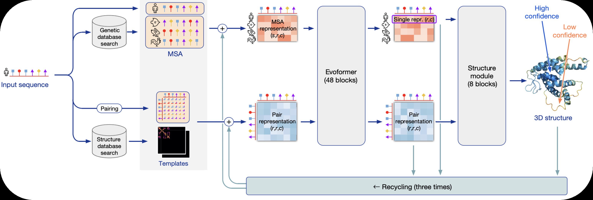
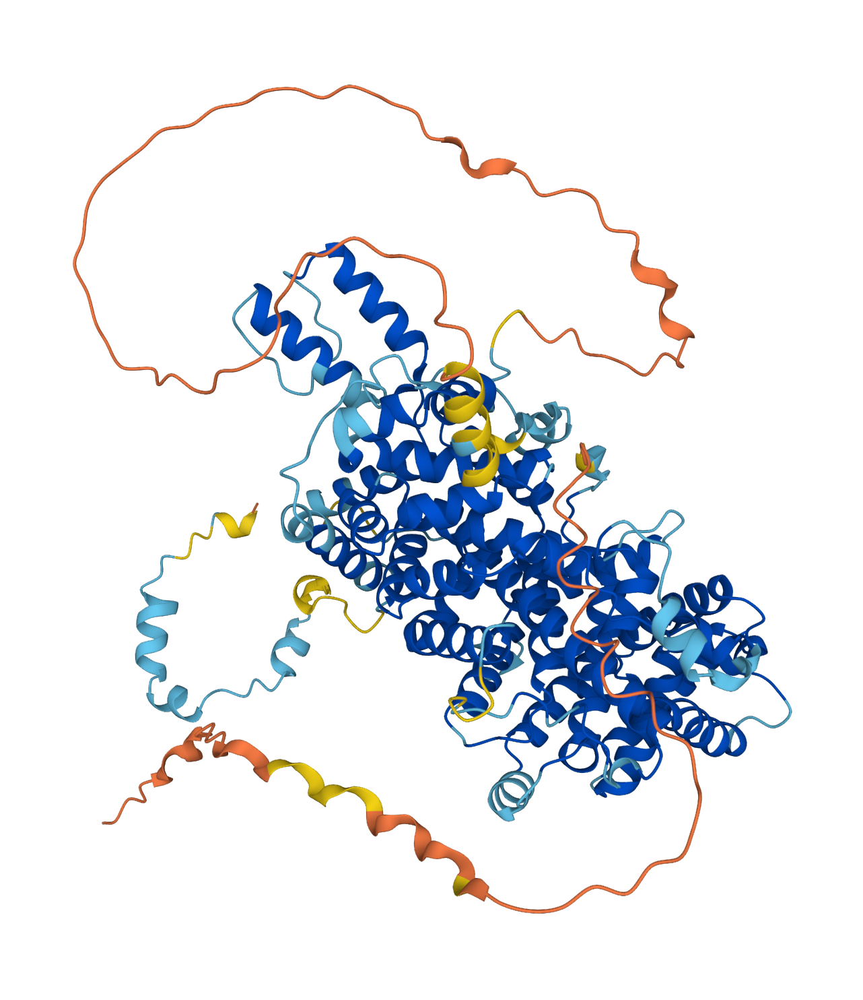
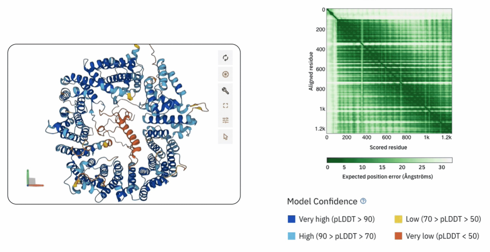
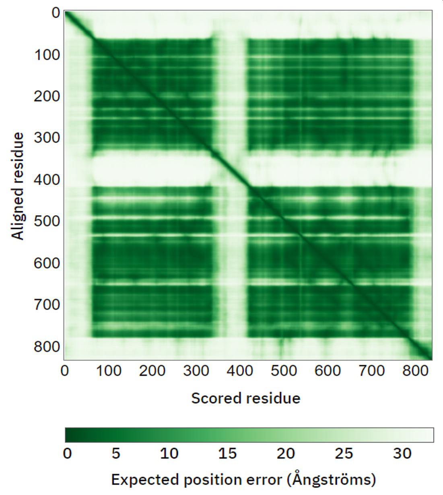
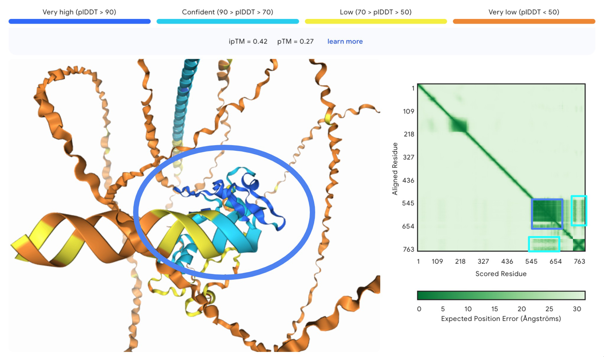
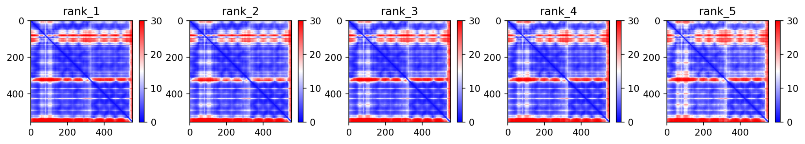
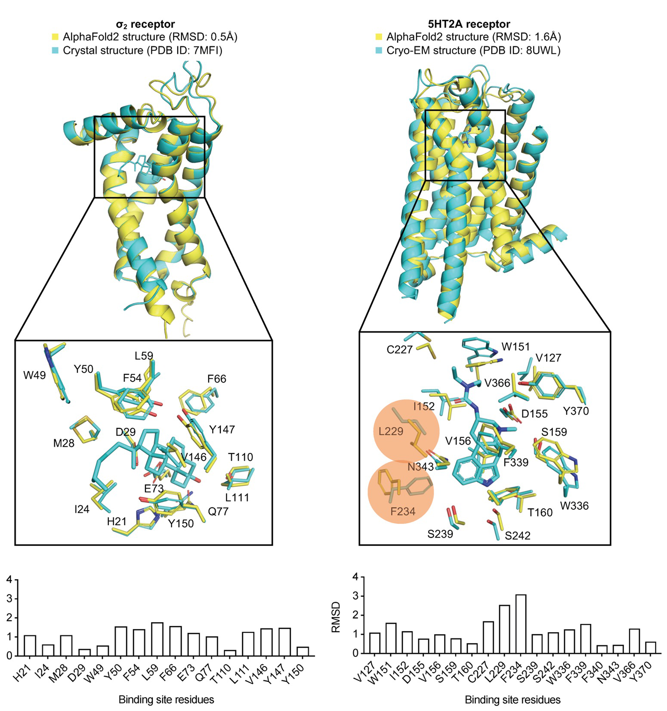

On November 30, 2020, John Moult presented the results of the fourteenth Critical Assessment of protein Structure Prediction to a virtual audience. CASP competitions had run biannually since 1994, each time inviting computational groups worldwide to predict the three-dimensional structures of proteins whose experimental structures had been solved but not yet released [@moult1995]. The results of CASP14 were unlike any that had come before.

A single group, registered as number 427, had achieved a median GDT-TS of 92.4 across all targets [@jumper2021]. GDT-TS is scored from 0 to 100; a score above 90 generally indicates a prediction accurate enough to rival the experimental structure itself. The second-best group scored around 75. The gap between first and second place in CASP14 was larger than any gap in the competition's twenty-six-year history.[^ch07-alphafold-1]

Group 427 was DeepMind's AlphaFold, running a completely new architecture that the team had developed over the preceding year and a half. For a community that had watched decades of slow, grinding progress on the protein folding problem, the result broke sharply from that history. Structure prediction for single domains was solved in practice.

This chapter develops AlphaFold2 (AF2) in depth: from sequence and alignment inputs through the Evoformer and structure module to losses, recycling, and confidence metrics [@jumper2021]. We then summarize AlphaFold3 (AF3), which generalizes the same high-level pattern---a pairwise trunk followed by a structure generator---but replaces the Evoformer with a lighter *Pairformer* and replaces invariant-point attention on backbone frames with a *diffusion* model over atomic coordinates, enabling proteins, nucleic acids, ligands, and ions in one framework [@abramson2024]. Diagrams reproduced from the primary papers are included where they clarify the geometry of the representations and the flow of tensors through the network. We begin with the folding problem and CASP.

# The Protein Folding Problem and CASP {#ch07-alphafold-sec:af2-folding-problem}

**The protein folding problem** asks a simple-looking question: given the linear sequence of amino acids in a protein, what three-dimensional structure will it adopt? Christian Anfinsen demonstrated in the 1960s and 1970s that the amino acid sequence alone determines the native fold [@anfinsen1973]. He denatured ribonuclease A, destroying its three-dimensional structure, and watched it refold spontaneously into the correct shape. The thermodynamic hypothesis that emerged from this work states that the native structure is the global minimum of the free energy landscape.

But knowing that a unique answer exists is very different from computing it. Cyrus Levinthal pointed out the combinatorial explosion that makes brute-force search hopeless [@levinthal1969]. A protein of 100 residues has roughly 99 backbone $\phi$/$\psi$ angle pairs. If each angle can take just three discrete values, the total number of conformations is $3^{198} \approx 10^{94}$. Even sampling one conformation per picosecond, it would take longer than the age of the universe to enumerate them all.[^ch07-alphafold-2] Proteins must fold by following kinetic pathways that avoid this exhaustive search. The folding problem, then, is not merely a search problem. It is the problem of discovering the physical and statistical principles that make the search tractable.

**CASP was founded in 1994** by John Moult and colleagues at the University of Maryland as a way to objectively assess progress on this problem [@moult1995]. The setup is straightforward. Experimental groups that have recently solved protein structures deposit their coordinates with CASP before public release. Prediction groups receive only the amino acid sequences and submit their best structural models. Assessors then compare predictions to the withheld experimental structures.

The first competition, CASP1, attracted 35 prediction groups and tested them on 33 targets. Results were sobering. Only proteins with close homologs of known structure could be predicted with any accuracy. *Ab initio* methods, which attempted to fold proteins from physics alone, performed little better than chance on targets without templates.

Progress over the next two decades was real but slow. Fragment-assembly methods like Rosetta improved *ab initio* prediction for small proteins. Co-evolutionary analysis of multiple sequence alignments began providing useful residue-residue contact predictions in the early 2010s. By CASP11 (2014), contact-based methods were the dominant approach.

**The first discontinuity came at CASP13** in December 2018. DeepMind entered a system called AlphaFold (now retroactively called AlphaFold1) that predicted inter-residue distance distributions using a deep neural network, then performed gradient-based optimization to find structures consistent with those predictions [@senior2020]. AlphaFold1 won CASP13 decisively, achieving a median GDT-TS of 68.5 on the hardest free-modeling targets, compared to roughly 47 for the next-best group.[^ch07-alphafold-3] The Baker group's trRosetta [@yang2020], which also predicted inter-residue geometries using a deep network, achieved similar accuracy in subsequent blind tests.

But AlphaFold1 was still a two-stage pipeline: predict distances, then fold. Information flowed from the sequence to the distance predictions and then to the structure, with no feedback loop. AlphaFold2, revealed at CASP14 two years later, replaced this pipeline with an end-to-end architecture that predicts structure directly.

## Measuring prediction quality: GDT-TS {#ch07-alphafold-sec:af2-gdtts .unnumbered}

We need a metric before we can discuss results. The Global Distance Test Total Score (GDT-TS) is the standard metric used in CASP [@zemla2003]. Given a predicted structure and the true experimental structure, both with $N$ residues, GDT-TS is defined as $$\begin{equation}
\label{eq:gdtts}
\text{GDT-TS} = \frac{1}{4}\bigl(P_1 + P_2 + P_4 + P_8\bigr),
\end{equation}$$ where $P_d$ is the percentage of C$\alpha$ atoms in the predicted structure that can be placed within $d$ Å of the corresponding C$\alpha$ atom in the true structure, after the superposition that maximizes $P_d$.[^ch07-alphafold-4] The score ranges from 0 to 100. A GDT-TS above 90 indicates that most atoms are within 1--2 Å of their experimental positions. Scores below 50 indicate that the overall fold has not been captured.

# Input Representations {#ch07-alphafold-sec:af2-inputs}

{#ch07-alphafold-fig:alphafold-pipeline width="\\linewidth"}

{reference-type="ref" reference="fig:alphafold-pipeline"}.](../../../figures/ch07_jumper2021_fig1.jpg){#ch07-alphafold-fig:jumper2021-fig1 width="\\linewidth"}

AlphaFold2 takes three types of input for a query protein of $N_\text{res}$ residues: a multiple sequence alignment, a set of pairwise residue features, and structural templates. These are encoded as two tensors that flow through the network: the *MSA representation* and the *pair representation*.

**The multiple sequence alignment** captures evolutionary information. Given a query sequence, AlphaFold2 searches genetic databases to find homologous sequences using iterative profile-based tools: jackhmmer [@eddy2011] against UniRef90 [@suzek2015] and MGnify [@mitchell2020], and HHblits [@remmert2012] against the BFD (Big Fantastic Database).[^ch07-alphafold-5] The search results are combined and deduplicated. For well-studied protein families, the resulting MSA can contain hundreds of thousands of sequences; for orphan proteins with few detectable homologs, the MSA may have only a handful.

The raw MSA is a matrix of amino acid identities with dimensions $N_\text{seq} \times N_\text{res}$, where $N_\text{seq}$ is the number of sequences (including the query) and $N_\text{res}$ is the number of residue positions in the query. AlphaFold2 embeds each amino acid (plus a gap token) into a $c_m$-dimensional vector, producing the initial MSA representation $$\begin{equation}
\label{eq:msa-rep}
\bm{m} \in \mathbb{R}^{N_\text{seq} \times N_\text{res} \times c_m},
\end{equation}$$ with $c_m = 256$ in the published model.[^ch07-alphafold-6] The first row of this tensor ($s = 1$) always corresponds to the query sequence and receives special treatment in parts of the network.

**The pair representation** encodes pairwise relationships between residue positions. It is a tensor $$\begin{equation}
\label{eq:pair-rep}
\bm{z} \in \mathbb{R}^{N_\text{res} \times N_\text{res} \times c_z},
\end{equation}$$ with $c_z = 128$. The initial pair representation is constructed from two sources. First, AlphaFold2 computes a per-residue feature vector $\bm{f}_i \in \mathbb{R}^{c_z}$ from the query sequence (one-hot amino acid encoding projected through a linear layer) and forms the outer sum $$\begin{equation}
\label{eq:pair-init}
z_{ij}^{(0)} = \bm{f}_i^{\text{left}} + \bm{f}_j^{\text{right}},
\end{equation}$$ where $\bm{f}^{\text{left}}$ and $\bm{f}^{\text{right}}$ are two separate linear projections of the same residue features. Second, a relative positional encoding is added. The signed distance $i - j$ is clipped to the range $[-32, 32]$ and embedded through a learned lookup table, producing a $c_z$-dimensional vector that is added to $z_{ij}^{(0)}$. This gives each entry in the pair representation knowledge of how far apart positions $i$ and $j$ are in the primary sequence.

**Template features** provide structural priors from known homologs. AlphaFold2 searches the PDB for structures that match the query by sequence, aligns them to the query, and extracts pairwise distance and orientation features. For each template, the C$\beta$ distance between aligned positions $i$ and $j$ is encoded, along with backbone torsion angles and a binary mask indicating which positions are present in the template. These template features are processed by a small neural network and added to the initial pair representation. When good templates exist, they provide a strong starting point. When they do not, the network relies entirely on the MSA.

We now have two tensors: $\bm{m}$ of shape $N_\text{seq} \times N_\text{res} \times c_m$ and $\bm{z}$ of shape $N_\text{res} \times N_\text{res} \times c_z$. The job of the Evoformer is to refine both of them, jointly, through 48 blocks of interleaved attention and update operations.

# The Evoformer {#ch07-alphafold-sec:af2-evoformer}

The Evoformer is the core of AlphaFold2. It takes the MSA representation and pair representation as input and produces refined versions of both through 48 identical blocks, each consisting of several attention and update operations. Information flows in both directions: from the MSA to the pair representation (through outer product means) and from the pair representation back to the MSA (through attention biases). This bidirectional coupling is what allows AlphaFold2 to jointly reason about evolutionary patterns and spatial relationships.

![Figure 3 of Jumper et al. (Nature, 2021, CC BY 4.0), aligned with the notation in this chapter. **a**, One Evoformer block: row/column MSA attention, outer-product mean to the pair stack, triangular multiplicative updates, triangular attention, transitions. **b**, Pair channels as directed edges on residue nodes. **c**, Triangle updates combine edges $(i,k)$ and $(k,j)$ to refine $(i,j)$. **d**, Structure module with invariant point attention (IPA). **e**, Residue "gas": independent frames (blue) and $\chi$ torsions (green) before enforcing chain geometry. **f**, Frame aligned point error (FAPE): comparing atoms in predicted vs. true frames $(R_k,\mathbf{t}_k)$, as in [\[sec:af2-fape\]](#sec:af2-fape){reference-type="ref" reference="sec:af2-fape"}.](../../../figures/ch07_jumper2021_fig3.jpg){#ch07-alphafold-fig:jumper2021-fig3 width="\\linewidth"}

Before we write down the full equations, we build intuition through a small example.

## Attention with pair bias: a worked example {#ch07-alphafold-sec:af2-attention-example .unnumbered}

Consider three residues at positions 1, 2, and 3. For simplicity, use a single attention head with key dimension $d_k = 1$, so that each residue's query and key are just scalars. Suppose the queries are $q = (1,\, 0,\, {-1})$ and the keys are $k = (1,\, 0,\, {-1})$.

The attention logit between positions $i$ and $j$ is $q_i k_j / \sqrt{d_k} = q_i k_j$. Arranging these into a matrix:[^ch07-alphafold-7] $$\begin{equation}
\label{eq:logit-example}
L = \begin{pmatrix} 1 & 0 & -1 \\ 0 & 0 & 0 \\ -1 & 0 & 1 \end{pmatrix}.
\end{equation}$$ Applying the softmax row-wise gives attention weights $$\begin{equation}
\label{eq:attn-example-nobias}
A = \begin{pmatrix} 0.67 & 0.24 & 0.09 \\ 0.33 & 0.33 & 0.33 \\ 0.09 & 0.24 & 0.67 \end{pmatrix}.
\end{equation}$$ Residue 1 attends mostly to itself, residue 3 attends mostly to itself, and residue 2 distributes its attention uniformly.

Now suppose the pair representation tells us that position 2 is a conserved catalytic residue that is structurally coupled to all other positions. We encode this as a bias matrix $$\begin{equation}
\label{eq:pair-bias-example}
B = \begin{pmatrix} 0 & 2 & 0 \\ 0 & 2 & 0 \\ 0 & 2 & 0 \end{pmatrix}.
\end{equation}$$ Adding this bias to the logits gives $L' = L + B$, and the new attention weights become $$\begin{equation}
\label{eq:attn-example-bias}
A' = \begin{pmatrix} 0.21 & 0.58 & 0.07 \\ 0.11 & 0.79 & 0.11 \\ 0.04 & 0.58 & 0.21 \end{pmatrix}.
\end{equation}$$ Every residue now attends strongly to position 2. The pair representation has redirected the flow of information in the MSA, steering each residue to incorporate features from the conserved catalytic site. This is the essential mechanism by which structural knowledge (encoded in $\bm{z}$) shapes the processing of evolutionary information (encoded in $\bm{m}$).

## MSA row-wise gated self-attention with pair bias {#ch07-alphafold-sec:af2-row-attn .unnumbered}

We now write the general equations. Each Evoformer block begins by updating the MSA representation through self-attention across residue positions, independently for each sequence $s$ in the MSA.[^ch07-alphafold-8] This is the operation illustrated by the worked example above, generalized to multiple heads and with gating.

Let $\bm{m}_{si} \in \mathbb{R}^{c_m}$ denote the MSA representation for sequence $s$ at position $i$, and let $\bm{z}_{ij} \in \mathbb{R}^{c_z}$ denote the pair representation for the position pair $(i, j)$. For each attention head $h = 1, \ldots, H$, we compute queries, keys, values, a pair bias, and a gate: $$\begin{align}
\bm{q}_{si}^h &= \bm{W}_Q^h\, \bm{m}_{si} \in \mathbb{R}^{d_k}, \label{eq:row-q} \\
\bm{k}_{si}^h &= \bm{W}_K^h\, \bm{m}_{si} \in \mathbb{R}^{d_k}, \label{eq:row-k} \\
\bm{v}_{si}^h &= \bm{W}_V^h\, \bm{m}_{si} \in \mathbb{R}^{d_v}, \label{eq:row-v} \\
b_{ij}^h &= \text{Linear}^h(\bm{z}_{ij}) \in \mathbb{R}, \label{eq:row-bias} \\
\bm{g}_{si}^h &= \sigma\!\bigl(\text{Linear}_g^h(\bm{m}_{si})\bigr) \in \mathbb{R}^{d_v}, \label{eq:row-gate}
\end{align}$$ where $\sigma$ is the sigmoid function and all Linear operations are learned affine maps (we omit bias terms for clarity).

The attention weights for head $h$ are $$\begin{equation}
\label{eq:row-attn-weights}
\alpha_{sij}^h = \mathop{\mathrm{softmax}}_j \left( \frac{(\bm{q}_{si}^h)^\top \bm{k}_{sj}^h}{\sqrt{d_k}} + b_{ij}^h \right).
\end{equation}$$ The pair bias $b_{ij}^h$ is the same for every sequence $s$. It is the channel through which the pair representation injects structural information into the MSA processing. The weighted values are modulated by the gate: $$\begin{equation}
\label{eq:row-output}
\bm{o}_{si}^h = \bm{g}_{si}^h \odot \sum_j \alpha_{sij}^h\, \bm{v}_{sj}^h,
\end{equation}$$ where $\odot$ denotes element-wise multiplication. The outputs from all heads are concatenated and projected: $$\begin{equation}
\label{eq:row-final}
\bm{m}_{si} \leftarrow \bm{m}_{si} + \bm{W}_O \,\text{concat}(\bm{o}_{si}^1, \ldots, \bm{o}_{si}^H).
\end{equation}$$ The gating mechanism in [\[eq:row-gate,eq:row-output\]](#eq:row-gate,eq:row-output){reference-type="ref" reference="eq:row-gate,eq:row-output"} allows the network to learn which value components should pass through and which should be suppressed. Standard transformers do not have this gate; AlphaFold2 found it essential for training stability.

## MSA column-wise gated self-attention {#ch07-alphafold-sec:af2-col-attn .unnumbered}

**The column-wise attention** operates in the orthogonal direction. Instead of attending across residue positions for a fixed sequence, we attend across sequences at a fixed position. For each residue position $i$, the representations $\{\bm{m}_{1i}, \bm{m}_{2i}, \ldots, \bm{m}_{N_\text{seq},i}\}$ attend to one another: $$\begin{align}
\bm{q}_{si}^h &= \bm{W}_Q^h\, \bm{m}_{si}, \quad
\bm{k}_{si}^h = \bm{W}_K^h\, \bm{m}_{si}, \quad
\bm{v}_{si}^h = \bm{W}_V^h\, \bm{m}_{si}, \label{eq:col-qkv} \\
\bm{g}_{si}^h &= \sigma\!\bigl(\text{Linear}_g^h(\bm{m}_{si})\bigr), \label{eq:col-gate} \\
\alpha_{ss'i}^h &= \mathop{\mathrm{softmax}}_{s'} \left( \frac{(\bm{q}_{si}^h)^\top \bm{k}_{s'i}^h}{\sqrt{d_k}} \right), \label{eq:col-attn-weights}
\end{align}$$ with the same gated aggregation and residual connection as before. There is no pair bias in this attention: the pair representation encodes relationships between positions, not between sequences.

What does column-wise attention accomplish? It allows information to flow between homologous sequences at the same alignment column. If position $i$ is a leucine in the query but a valine in sequence $s'$, the column-wise attention lets the network learn what this substitution pattern implies about the structural context of position $i$. In effect, it reads covariation patterns directly from the alignment, column by column.[^ch07-alphafold-9]

## From sequences to pairs: the outer product mean {#ch07-alphafold-sec:af2-opm .unnumbered}

**The outer product mean** is the primary mechanism by which information flows from the MSA representation to the pair representation. It converts column-wise covariation patterns in the MSA into pairwise features.

For each sequence $s$ and position $i$, we project the MSA representation to a lower-dimensional space: $$\begin{equation}
\label{eq:opm-proj}
\bm{a}_{si} = \text{Linear}^a(\bm{m}_{si}) \in \mathbb{R}^c, \quad
\bm{b}_{si} = \text{Linear}^b(\bm{m}_{si}) \in \mathbb{R}^c.
\end{equation}$$ We then compute the outer product of $\bm{a}_{si}$ and $\bm{b}_{sj}$ for each position pair $(i,j)$ and average over all sequences: $$\begin{equation}
\label{eq:opm}
\bm{o}_{ij} = \frac{1}{N_\text{seq}} \sum_{s=1}^{N_\text{seq}} \bm{a}_{si} \otimes \bm{b}_{sj} \in \mathbb{R}^{c \times c},
\end{equation}$$ where $\otimes$ denotes the outer product (producing a $c \times c$ matrix for each pair). This matrix is flattened to a vector of dimension $c^2$ and projected to update the pair representation: $$\begin{equation}
\label{eq:opm-update}
\bm{z}_{ij} \leftarrow \bm{z}_{ij} + \text{Linear}^O\!\bigl(\text{flatten}(\bm{o}_{ij})\bigr).
\end{equation}$$

Why does this work? Consider what the outer product $\bm{a}_{si} \otimes \bm{b}_{sj}$ captures. If positions $i$ and $j$ co-evolve (i.e., mutations at $i$ are correlated with mutations at $j$ across the alignment), then the average outer product will have systematic structure that reflects this correlation. Positions that are in contact in the 3D structure tend to co-evolve because a mutation at one position must be compensated by a compatible mutation at the other to maintain the interaction.[^ch07-alphafold-10] The outer product mean distills this signal from the full MSA and injects it into the pair representation, one Evoformer block at a time.

## Triangular multiplicative updates {#ch07-alphafold-sec:af2-tri-mult .unnumbered}

**The pair representation $\bm{z}$** is an $N_\text{res} \times N_\text{res}$ matrix (with a channel dimension), and we can think of it as encoding information about edges in a graph over residue positions. The entry $\bm{z}_{ij}$ describes the relationship between positions $i$ and $j$. For this representation to be self-consistent, it should respect a basic geometric constraint: for any three residues $i$, $j$, and $k$, the information in $\bm{z}_{ij}$ should be consistent with the information in $\bm{z}_{ik}$ and $\bm{z}_{kj}$. In terms of distances, this is the triangle inequality: $d(i,j) \leq d(i,k) + d(k,j)$.

The triangular multiplicative updates enforce this consistency. There are two variants, distinguished by whether the shared index $k$ appears as the starting node or the ending node of the two edges being combined.

**The outgoing update** computes, for each pair $(i,j)$, a sum over all intermediate positions $k$ that combines outgoing edges from $i$ and from $j$: $$\begin{align}
\bm{a}_{ik} &= \sigma\!\bigl(\text{Linear}^{a_g}(\bm{z}_{ik})\bigr) \odot \text{Linear}^a(\bm{z}_{ik}), \label{eq:tri-out-a} \\
\bm{b}_{jk} &= \sigma\!\bigl(\text{Linear}^{b_g}(\bm{z}_{jk})\bigr) \odot \text{Linear}^b(\bm{z}_{jk}), \label{eq:tri-out-b} \\
\bm{g}_{ij} &= \sigma\!\bigl(\text{Linear}^g(\bm{z}_{ij})\bigr), \label{eq:tri-out-gate} \\
\bm{z}_{ij} &\leftarrow \bm{z}_{ij} + \bm{g}_{ij} \odot \text{Linear}^O\!\left(\sum_k \bm{a}_{ik} \odot \bm{b}_{jk}\right). \label{eq:tri-out-update}
\end{align}$$ Each projection in [\[eq:tri-out-a,eq:tri-out-b\]](#eq:tri-out-a,eq:tri-out-b){reference-type="ref" reference="eq:tri-out-a,eq:tri-out-b"} has two components: a sigmoid gate and a linear projection. The gate controls which channels of the edge representation contribute to the update. The sum over $k$ in [\[eq:tri-out-update\]](#eq:tri-out-update){reference-type="ref" reference="eq:tri-out-update"} aggregates information from all triangles $(i, j, k)$ where we combine the edges $i \to k$ and $j \to k$.

To see why this helps, consider a case where $\bm{z}_{ik}$ has learned that positions $i$ and $k$ are close in space, and $\bm{z}_{jk}$ has learned that $j$ and $k$ are close. The product $\bm{a}_{ik} \odot \bm{b}_{jk}$ will be large, and this signal propagates into $\bm{z}_{ij}$, encouraging the network to also predict that $i$ and $j$ are close. This is exactly the triangle inequality at work.

**The incoming update** has the same structure but transposes the role of the shared index: $$\begin{align}
\bm{a}_{ki} &= \sigma\!\bigl(\text{Linear}^{a_g}(\bm{z}_{ki})\bigr) \odot \text{Linear}^a(\bm{z}_{ki}), \label{eq:tri-in-a} \\
\bm{b}_{kj} &= \sigma\!\bigl(\text{Linear}^{b_g}(\bm{z}_{kj})\bigr) \odot \text{Linear}^b(\bm{z}_{kj}), \label{eq:tri-in-b} \\
\bm{z}_{ij} &\leftarrow \bm{z}_{ij} + \bm{g}_{ij} \odot \text{Linear}^O\!\left(\sum_k \bm{a}_{ki} \odot \bm{b}_{kj}\right). \label{eq:tri-in-update}
\end{align}$$ Here we combine edges incoming to $i$ (from $k$) and incoming to $j$ (from $k$), aggregating over all possible sources $k$. Between the two variants, every triangle $(i, j, k)$ is covered regardless of edge direction.[^ch07-alphafold-11]

## Triangular self-attention {#ch07-alphafold-sec:af2-tri-attn .unnumbered}

**In addition to the multiplicative updates**, the Evoformer applies self-attention directly on the pair representation. There are two variants: attention around the *starting node* and attention around the *ending node*.

For attention around the starting node, we fix the first index $i$ and apply self-attention across the second index. In other words, for each row $i$ of the pair matrix, positions $j$ attend to positions $k$ using queries and keys derived from $\bm{z}_{ij}$ and $\bm{z}_{ik}$, with a bias derived from $\bm{z}_{jk}$: $$\begin{align}
\bm{q}_{ij}^h &= \bm{W}_Q^h\, \bm{z}_{ij}, \quad
\bm{k}_{ik}^h = \bm{W}_K^h\, \bm{z}_{ik}, \quad
\bm{v}_{ik}^h = \bm{W}_V^h\, \bm{z}_{ik}, \label{eq:tri-attn-start-qkv} \\
b_{jk}^h &= \text{Linear}^h(\bm{z}_{jk}), \label{eq:tri-attn-start-bias} \\
\alpha_{ijk}^h &= \mathop{\mathrm{softmax}}_k \left( \frac{(\bm{q}_{ij}^h)^\top \bm{k}_{ik}^h}{\sqrt{d_k}} + b_{jk}^h \right), \label{eq:tri-attn-start-weights} \\
\bm{z}_{ij} &\leftarrow \bm{z}_{ij} + \bm{W}_O \, \text{concat}_h \!\left(\bm{g}_{ij}^h \odot \sum_k \alpha_{ijk}^h\, \bm{v}_{ik}^h\right). \label{eq:tri-attn-start-out}
\end{align}$$ The bias $b_{jk}^h$ from $\bm{z}_{jk}$ means that when deciding how much $\bm{z}_{ij}$ should attend to $\bm{z}_{ik}$, the network consults the relationship between $j$ and $k$. This is another form of triangle reasoning: the update to edge $(i,j)$ depends on the third edge $(j,k)$ of the triangle.

Attention around the ending node is identical but with transposed indices: we fix $j$ and attend across the first index, using $\bm{z}_{ij}$ and $\bm{z}_{kj}$ as queries and keys, with bias from $\bm{z}_{ik}$.

**Each Evoformer block** chains all of these operations together with layer normalization and residual connections.[^ch07-alphafold-12] After 48 such blocks, the refined MSA representation and pair representation are passed to the structure module. The first row of the MSA representation (corresponding to the query sequence) is extracted as the *single representation* $\bm{s}_i \in \mathbb{R}^{c_s}$ for each residue $i$, with $c_s = c_m = 256$.

# The Structure Module {#ch07-alphafold-sec:af2-structure}

The structure module converts the abstract representations from the Evoformer into a concrete three-dimensional structure. [3](#fig:jumper2021-fig3){reference-type="ref" reference="fig:jumper2021-fig3"} d summarizes its placement in the full model: the single representation is the first MSA row; IPA layers update features while a separate head refines each residue's rigid frame. Its central innovation is Invariant Point Attention (IPA), an attention mechanism that operates on 3D points while respecting the symmetries of Euclidean space.

## Representing protein backbones as rigid frames {#ch07-alphafold-sec:af2-frames .unnumbered}

Each residue $i$ in a protein has a backbone consisting of three heavy atoms: N, C$\alpha$, and C. These three atoms define a local coordinate frame. AlphaFold2 represents each residue's frame as a rigid-body transformation $T_i = (\bm{R}_i, \bm{t}_i) \in \mathrm{SE}(3)$, where $\bm{R}_i \in \mathrm{SO}(3)$ is a rotation matrix and $\bm{t}_i \in \mathbb{R}^3$ is a translation vector. The transformation $T_i$ maps points from the local frame of residue $i$ to the global coordinate system: $$\begin{equation}
\label{eq:frame-transform}
T_i \circ \bm{x}= \bm{R}_i \bm{x}+ \bm{t}_i.
\end{equation}$$ The inverse transformation maps global coordinates back to the local frame: $$\begin{equation}
\label{eq:frame-inverse}
T_i^{-1} \circ \bm{x}= \bm{R}_i^\top (\bm{x}- \bm{t}_i).
\end{equation}$$

The structure module maintains a set of frames $\{T_i\}_{i=1}^{N_\text{res}}$, initialized to the identity (all residues at the origin with the same orientation). Through eight iterations of IPA followed by backbone updates, these frames are iteratively refined until they describe the predicted protein structure.

## Invariant Point Attention {#ch07-alphafold-sec:af2-ipa .unnumbered}

The key requirement for IPA is that its output must not change when the entire protein is rotated or translated.[^ch07-alphafold-13] Standard attention mechanisms operate on abstract feature vectors and have no notion of geometry. IPA achieves geometric invariance by incorporating 3D points into the attention computation and carefully transforming them between local and global frames.

Each residue $i$ has a single representation $\bm{s}_i \in \mathbb{R}^{c_s}$, a pair representation $\bm{z}_{ij} \in \mathbb{R}^{c_z}$ (shared with residue $j$), and a current backbone frame $T_i$. For each of $H$ attention heads, IPA computes three types of interactions.

**Scalar attention** is standard. For head $h$: $$\begin{equation}
\label{eq:ipa-scalar-qkv}
\bm{q}_i^h = \bm{W}_Q^h \bm{s}_i, \quad
\bm{k}_j^h = \bm{W}_K^h \bm{s}_j, \quad
\bm{v}_j^h = \bm{W}_V^h \bm{s}_j.
\end{equation}$$

**Point attention** operates on 3D coordinates. For each head $h$ and each of $N_p$ query/key point slots, the network generates 3D point vectors in the local frame of each residue and then transforms them to the global frame:[^ch07-alphafold-14] $$\begin{align}
\hat{\bm{q}}_{i}^{h,p} &= T_i \circ \bigl(\bm{W}_{Qp}^{h,p} \bm{s}_i\bigr) = \bm{R}_i \bm{W}_{Qp}^{h,p} \bm{s}_i + \bm{t}_i, \label{eq:ipa-point-q} \\
\hat{\bm{k}}_{j}^{h,p} &= T_j \circ \bigl(\bm{W}_{Kp}^{h,p} \bm{s}_j\bigr) = \bm{R}_j \bm{W}_{Kp}^{h,p} \bm{s}_j + \bm{t}_j, \label{eq:ipa-point-k}
\end{align}$$ where $\bm{W}_{Qp}^{h,p}$ and $\bm{W}_{Kp}^{h,p}$ are learned linear maps from $\mathbb{R}^{c_s}$ to $\mathbb{R}^3$. Each query point $\hat{\bm{q}}_{i}^{h,p}$ lives in global 3D space: it is a point generated in residue $i$'s local frame and then rotated and translated to match $i$'s current position and orientation. The value points $\hat{\bm{v}}_{j}^{h,p}$ are constructed analogously using $N_{pv}$ point slots.

**Pair bias** extracts a scalar from the pair representation: $$\begin{equation}
\label{eq:ipa-pair-bias}
b_{ij}^h = \text{Linear}^h(\bm{z}_{ij}).
\end{equation}$$

The attention logits combine all three components: $$\begin{equation}
\label{eq:ipa-logits}
a_{ij}^h = \underbrace{\frac{w_L}{\sqrt{d_k}} (\bm{q}_i^h)^\top \bm{k}_j^h}_{\text{scalar}} \;+\; \underbrace{b_{ij}^h}_{\text{pair}} \;+\; \underbrace{w_P \gamma^h \sum_{p=1}^{N_p} \!\left(-\frac{1}{2}\right) \bigl\|\hat{\bm{q}}_i^{h,p} - \hat{\bm{k}}_j^{h,p}\bigr\|^2}_{\text{point}},
\end{equation}$$ where $w_L$ and $w_P$ are constant scaling factors that balance the three terms, $\gamma^h$ is a learned per-head weight (passed through a softplus to ensure positivity), and the point term penalizes large distances between query and key points.[^ch07-alphafold-15] The attention weights are $$\begin{equation}
\label{eq:ipa-weights}
\alpha_{ij}^h = \mathop{\mathrm{softmax}}_j(a_{ij}^h).
\end{equation}$$

The output of IPA for residue $i$ and head $h$ has three parts. The scalar output is $$\begin{equation}
\label{eq:ipa-out-scalar}
\bm{o}_i^{h,\text{scal}} = \sum_j \alpha_{ij}^h \,\bm{v}_j^h.
\end{equation}$$ The pair output is $$\begin{equation}
\label{eq:ipa-out-pair}
\bm{o}_i^{h,\text{pair}} = \sum_j \alpha_{ij}^h \,\text{Linear}^h(\bm{z}_{ij}).
\end{equation}$$ The point output aggregates value points in global coordinates, then transforms the result back to the local frame of residue $i$: $$\begin{equation}
\label{eq:ipa-out-point}
\bm{o}_i^{h,p} = T_i^{-1} \circ \left(\sum_j \alpha_{ij}^h \,\hat{\bm{v}}_j^{h,p}\right) = \bm{R}_i^\top \left(\sum_j \alpha_{ij}^h \,\hat{\bm{v}}_j^{h,p} - \bm{t}_i\right).
\end{equation}$$ The transformation back to the local frame in [\[eq:ipa-out-point\]](#eq:ipa-out-point){reference-type="ref" reference="eq:ipa-out-point"} is what gives IPA its invariance.

**We can prove that IPA is $\mathrm{SE}(3)$-invariant.** Suppose we apply a global rigid transformation $T_g = (\bm{R}_g, \bm{t}_g)$ to every frame, replacing $T_i$ with $T_g \circ T_i$ for all $i$. Each query point transforms as $$\begin{equation}
\label{eq:ipa-invariance-q}
\hat{\bm{q}}_i^{h,p} \;\to\; \bm{R}_g \hat{\bm{q}}_i^{h,p} + \bm{t}_g,
\end{equation}$$ and similarly for key points. The squared distance in the point attention term becomes $$\begin{equation}
\label{eq:ipa-invariance-dist}
\bigl\|(\bm{R}_g \hat{\bm{q}}_i^{h,p} + \bm{t}_g) - (\bm{R}_g \hat{\bm{k}}_j^{h,p} + \bm{t}_g)\bigr\|^2
= \bigl\|\bm{R}_g (\hat{\bm{q}}_i^{h,p} - \hat{\bm{k}}_j^{h,p})\bigr\|^2
= \bigl\|\hat{\bm{q}}_i^{h,p} - \hat{\bm{k}}_j^{h,p}\bigr\|^2,
\end{equation}$$ because rotation matrices preserve norms: $\|\bm{R}_g \bm{x}\|^2 = \bm{x}^\top \bm{R}_g^\top \bm{R}_g \bm{x}= \|\bm{x}\|^2$. The attention weights $\alpha_{ij}^h$ are therefore unchanged.

For the point output, the aggregated value point in the transformed system is $\bm{R}_g (\sum_j \alpha_{ij}^h \hat{\bm{v}}_j^{h,p}) + \bm{t}_g$. Applying the inverse of the transformed frame $(T_g \circ T_i)^{-1} = T_i^{-1} \circ T_g^{-1}$: $$\begin{equation}
\label{eq:ipa-invariance-output}
T_i^{-1} \!\circ\! T_g^{-1} \!\circ\! \bigl(\bm{R}_g \textstyle\sum_j \alpha_{ij}^h \hat{\bm{v}}_j^{h,p} + \bm{t}_g\bigr)
= T_i^{-1} \!\circ\! \bigl(\textstyle\sum_j \alpha_{ij}^h \hat{\bm{v}}_j^{h,p}\bigr),
\end{equation}$$ which is exactly the original point output. The scalar and pair outputs do not involve frames at all and are trivially invariant. The entire IPA operation is therefore $\mathrm{SE}(3)$-invariant: rotating the protein in space does not change the updated representations.

The final single representation update concatenates all head outputs: $$\begin{equation}
\label{eq:ipa-final}
\bm{s}_i \leftarrow \bm{s}_i + \text{Linear}^O\!\left(
\text{concat}_{h}\!\bigl[
\bm{o}_i^{h,\text{scal}},\;
\bm{o}_i^{h,\text{pair}},\;
\text{flatten}(\bm{o}_i^{h,1}, \ldots, \bm{o}_i^{h,N_{pv}}),\;
\bigl\|\bm{o}_i^{h,1}\bigr\|, \ldots, \bigl\|\bm{o}_i^{h,N_{pv}}\bigr\|
\bigr]
\right).
\end{equation}$$ The point norms $\|\bm{o}_i^{h,p}\|$ are included because they are rotationally invariant scalars that encode distance information.

## Backbone frame updates {#ch07-alphafold-sec:af2-backbone-update .unnumbered}

After each IPA layer, the backbone frames are updated. A linear layer maps the updated single representation $\bm{s}_i$ to a 6-dimensional vector encoding a small rigid-body correction: $$\begin{equation}
\label{eq:frame-update}
T_i \leftarrow T_i \circ \Delta T_i, \quad \text{where } \Delta T_i = (\Delta\bm{R}_i, \Delta\bm{t}_i) = f_\text{update}(\bm{s}_i).
\end{equation}$$ The rotation update $\Delta\bm{R}_i$ is parameterized through a representation that ensures orthogonality (a quaternion normalized to unit length, or a Gram-Schmidt procedure applied to two predicted 3-vectors). The translation update $\Delta\bm{t}_i \in \mathbb{R}^3$ shifts the residue's position in its current local frame. Composing the update with the current frame means that the correction is applied *relative to the current pose*, allowing the structure to be refined incrementally over eight iterations of the structure module.

After the final iteration, the backbone atom positions (N, C$\alpha$, C) for each residue are computed from the frames using ideal bond lengths and angles. The C$\alpha$ position is simply the translation component $\bm{t}_i$ of the final frame $T_i$.

## Side-chain prediction {#ch07-alphafold-sec:af2-sidechain .unnumbered}

**Side-chain conformations** are predicted by a separate small network operating on the final single representations. Each amino acid type has up to four torsion angles ($\chi_1, \chi_2, \chi_3, \chi_4$) that determine side-chain geometry. A shared ResNet takes $\bm{s}_i$ and the initial single representation as input and predicts each $\chi$ angle as a pair $(\sin\chi, \cos\chi)$ to avoid discontinuities at $\pm 180^\circ$.[^ch07-alphafold-16] Full atomic coordinates for all side-chain atoms are then computed from the predicted torsion angles using ideal bond geometries.

# Training the Network {#ch07-alphafold-sec:af2-losses}

AlphaFold2 is trained end-to-end with a composite loss function. Each component addresses a different aspect of structural accuracy or provides an auxiliary training signal. We describe the five main losses.

## Frame Aligned Point Error (FAPE) {#ch07-alphafold-sec:af2-fape .unnumbered}

The primary structural loss is the Frame Aligned Point Error [@jumper2021]. [3](#fig:jumper2021-fig3){reference-type="ref" reference="fig:jumper2021-fig3"} f matches the schematic in the original paper: every anchor frame compares predicted and true atom maps in local coordinates before clamping and averaging. FAPE measures the accuracy of predicted atom positions by comparing them to the true positions *in the local coordinate frame of each residue*.

Let $\{\bm{x}_j^\text{pred}\}$ and $\{\bm{x}_j^\text{true}\}$ be the predicted and true positions of all backbone atoms, and let $\{T_i^\text{pred}\}$ and $\{T_i^\text{true}\}$ be the predicted and true backbone frames. FAPE is defined as $$\begin{equation}
\label{eq:fape}
\mathcal{L}_\text{FAPE} = \frac{1}{N_\text{frames}} \sum_{i=1}^{N_\text{frames}} \frac{1}{N_\text{atoms}} \sum_{j=1}^{N_\text{atoms}} \left\| (T_i^\text{pred})^{-1} \!\circ\, \bm{x}_j^\text{pred} \;-\; (T_i^\text{true})^{-1} \!\circ\, \bm{x}_j^\text{true} \right\|_d,
\end{equation}$$ where $\|\cdot\|_d = \min(\|\cdot\|, d)$ is a clamped norm with cutoff $d = 10$ Å that reduces the influence of large outlier errors.

The intuition is best seen through an example. **Consider two residues** with identity rotation matrices placed along the $x$-axis. In the true structure, residue 1 sits at the origin and residue 2 sits at $(3.8, 0, 0)$ Å. In the predicted structure, residue 1 is at the origin but residue 2 is at $(4.1, 0, 0)$ Å, a small error of 0.3 Å in the inter-residue distance.

We compute four terms (two frames, two atoms each).[^ch07-alphafold-17] In frame 1 (centered at the origin): $$\begin{align*}
(T_1^\text{true})^{-1}\!\circ\,\bm{x}_1^\text{true} &= (0, 0, 0), \quad (T_1^\text{pred})^{-1}\!\circ\,\bm{x}_1^\text{pred} = (0, 0, 0), \quad \text{error} = 0, \\
(T_1^\text{true})^{-1}\!\circ\,\bm{x}_2^\text{true} &= (3.8, 0, 0), \quad (T_1^\text{pred})^{-1}\!\circ\,\bm{x}_2^\text{pred} = (4.1, 0, 0), \quad \text{error} = 0.3.
\end{align*}$$ In frame 2 (centered at residue 2): $$\begin{align*}
(T_2^\text{true})^{-1}\!\circ\,\bm{x}_1^\text{true} &= (-3.8, 0, 0), \quad (T_2^\text{pred})^{-1}\!\circ\,\bm{x}_1^\text{pred} = (-4.1, 0, 0), \quad \text{error} = 0.3, \\
(T_2^\text{true})^{-1}\!\circ\,\bm{x}_2^\text{true} &= (0, 0, 0), \quad (T_2^\text{pred})^{-1}\!\circ\,\bm{x}_2^\text{pred} = (0, 0, 0), \quad \text{error} = 0.
\end{align*}$$ The FAPE loss is $\frac{1}{2} \cdot \frac{1}{2}(0 + 0.3 + 0.3 + 0) = 0.15$ Å.

FAPE differs from RMSD in an important way. RMSD requires a single global superposition, which means that a multi-domain protein with well-predicted individual domains but a slightly wrong inter-domain angle receives a harsh penalty. FAPE evaluates accuracy *locally*, through each residue's own frame. If the domains are individually correct, the per-frame errors within each domain will be small regardless of the inter-domain geometry. This makes FAPE a natural loss for a model that predicts local frames.

## Distogram loss {#ch07-alphafold-sec:af2-distogram .unnumbered}

The Evoformer's pair representation is also trained to predict pairwise C$\beta$ distances.[^ch07-alphafold-18] The true C$\beta$--C$\beta$ distance between residues $i$ and $j$ is discretized into 64 bins spanning 2.3125 Å to 21.6875 Å (with an extra bin for distances beyond 22 Å), and the network predicts a probability distribution over these bins.

A linear layer maps $\bm{z}_{ij}$ to logits $\bm{l}_{ij} \in \mathbb{R}^{64}$. The loss is the cross-entropy between the predicted distribution and the one-hot encoding of the true distance bin: $$\begin{equation}
\label{eq:distogram-loss}
\mathcal{L}_\text{dist} = -\frac{1}{N_\text{res}^2} \sum_{i,j} \sum_{b=1}^{64} y_{ij}^b \log \mathop{\mathrm{softmax}}(\bm{l}_{ij})_b,
\end{equation}$$ where $y_{ij}^b = 1$ if the true distance falls in bin $b$ and 0 otherwise.

This loss serves two purposes. It provides a direct training signal to the pair representation, encouraging it to encode distance information. It also produces a predicted distance distribution (distogram) as a byproduct, which can be useful for downstream analysis.

## Predicted lDDT (pLDDT) loss {#ch07-alphafold-sec:af2-plddt-loss .unnumbered}

AlphaFold2 trains a per-residue confidence predictor alongside the structure. The target is the local Distance Difference Test (lDDT) [@mariani2013], a metric that evaluates how well the predicted structure preserves local distance patterns.

For a given residue $i$, lDDT considers all other residues $j$ whose C$\alpha$ atoms are within 15 Å in the *true* structure. For each such pair, we check whether the predicted C$\alpha$--C$\alpha$ distance is within a tolerance $t$ of the true distance: $$\begin{equation}
\label{eq:lddt-preserved}
P_t(i,j) = \begin{cases} 1 & \text{if } \bigl|d^\text{pred}(i,j) - d^\text{true}(i,j)\bigr| < t, \\ 0 & \text{otherwise}. \end{cases}
\end{equation}$$ The lDDT score for residue $i$ is the average preservation rate across four distance thresholds: $$\begin{equation}
\label{eq:lddt-per-residue}
\text{lDDT}(i) = \frac{1}{4 \,|\mathcal{N}_i|} \sum_{t \in \{0.5, 1, 2, 4\}} \sum_{j \in \mathcal{N}_i} P_t(i,j),
\end{equation}$$ where $\mathcal{N}_i$ is the set of residues within 15 Å of residue $i$ in the true structure.

During training, the true lDDT is computed from the predicted and true structures, binned into 50 equal intervals from 0 to 1, and a linear head on the single representation $\bm{s}_i$ is trained to predict this bin using a cross-entropy loss: $$\begin{equation}
\label{eq:plddt-loss}
\mathcal{L}_\text{pLDDT} = -\frac{1}{N_\text{res}} \sum_i \sum_{b=1}^{50} y_i^b \log \mathop{\mathrm{softmax}}(\bm{l}_i)_b.
\end{equation}$$ At inference, this head produces the predicted lDDT (pLDDT) confidence score.

## Masked MSA loss {#ch07-alphafold-sec:af2-masked-msa .unnumbered}

Following the masked language modeling approach of BERT [@devlin2019], AlphaFold2 randomly masks 15% of the amino acids in the MSA input and trains the network to predict the masked identities from the context. This is an auxiliary loss applied to the final MSA representation: $$\begin{equation}
\label{eq:masked-msa-loss}
\mathcal{L}_\text{MSA} = -\frac{1}{|\mathcal{M}|} \sum_{(s,i) \in \mathcal{M}} \log p\bigl(a_{si}^\text{true} \mid \bm{m}_{si}\bigr),
\end{equation}$$ where $\mathcal{M}$ is the set of masked positions and $p(a_{si}^\text{true} \mid \bm{m}_{si})$ is the probability assigned to the true amino acid by a linear layer followed by softmax applied to the MSA representation $\bm{m}_{si}$.

The masked MSA loss forces the network to maintain a rich representation of evolutionary information throughout the Evoformer. Without it, the MSA representation could collapse to a form that is useful for pair updates but discards the sequence identity information that co-evolutionary analysis depends on.

## Predicted Aligned Error (PAE) loss {#ch07-alphafold-sec:af2-pae-loss .unnumbered}

The Predicted Aligned Error head learns to predict the positional error of residue $j$ when the predicted and true structures are superimposed on residue $i$. The true aligned error is $$\begin{equation}
\label{eq:aligned-error}
e_{ij} = \bigl\| T_i^{-1} \circ \bm{x}_j^\text{pred} - T_i^{-1} \circ \bm{x}_j^\text{true} \bigr\|,
\end{equation}$$ which is simply the distance between the predicted and true positions of $j$'s C$\alpha$ after alignment in $i$'s frame. This quantity is binned into 64 intervals of 0.5 Å width (covering 0 to 32 Å), and a linear head on $(\bm{z}_{ij} + \bm{z}_{ji})/2$ is trained with cross-entropy: $$\begin{equation}
\label{eq:pae-loss}
\mathcal{L}_\text{PAE} = -\frac{1}{N_\text{res}^2} \sum_{i,j} \sum_{b=1}^{64} y_{ij}^b \log \mathop{\mathrm{softmax}}(\bm{l}_{ij})_b.
\end{equation}$$ The PAE loss trains the network to know not just whether its predictions are good, but *where* they are good and where they are uncertain.

**The total loss** is a weighted sum of all components: $$\begin{equation}
\label{eq:total-loss}
\mathcal{L} = \mathcal{L}_\text{FAPE}^\text{backbone} + 0.5\,\mathcal{L}_\text{FAPE}^\text{all-atom} + 0.3\,\mathcal{L}_\text{dist} + 0.01\,\mathcal{L}_\text{pLDDT} + 2.0\,\mathcal{L}_\text{MSA} + 0.1\,\mathcal{L}_\text{PAE},
\end{equation}$$ where $\mathcal{L}_\text{FAPE}^\text{all-atom}$ includes side-chain atoms and uses a smaller clamping distance.[^ch07-alphafold-19] The loss is computed only on the output of the final recycling iteration (described next), and gradients do not flow through the recycling boundary.

# Recycling {#ch07-alphafold-sec:af2-recycling}

A single pass through the Evoformer and structure module produces a structure, but it is not the best structure the network can produce. AlphaFold2 uses *recycling*: the output of one forward pass is fed back as additional input to the next.

Concretely, after each pass, the final pair representation $\bm{z}$ and the C$\alpha$ positions predicted by the structure module are retained. For the next pass, the pair representation from the previous iteration is added to the freshly initialized pair representation before it enters the Evoformer. The C$\alpha$ positions from the previous iteration are used to compute a pairwise distance matrix, which is passed through a set of distance bins and projected to a $c_z$-dimensional vector, then added to the pair representation. The first-row single representation from the previous Evoformer output is similarly recycled.

The default configuration uses three recycling iterations.[^ch07-alphafold-20] Each iteration refines the structure. The first iteration operates without any prior structural information and produces a rough fold. The second and third iterations benefit from the structure predicted in the previous round, allowing the Evoformer to correct errors and refine details. Empirically, most of the accuracy gain comes from the first recycling step; the third iteration provides modest but consistent improvements.

# Confidence Metrics {#ch07-alphafold-sec:af2-confidence}

A prediction is only as useful as the confidence we can place in it. AlphaFold2 produces two complementary confidence metrics that together give a detailed picture of prediction reliability.

## Predicted lDDT (pLDDT) {#ch07-alphafold-sec:af2-plddt .unnumbered}

::: {.column-margin}
{width="\\linewidth"}
:::

**The pLDDT score** is a per-residue measure of local confidence. It predicts, for each residue, how well the local distance environment is reproduced in the predicted structure. As described in [\[sec:af2-plddt-loss\]](#sec:af2-plddt-loss){reference-type="ref" reference="sec:af2-plddt-loss"}, the pLDDT head is trained to predict the true lDDT score, and at inference the predicted value is the confidence metric.

The structural biology community has adopted the following rough calibration:

::: center
  pLDDT range   Interpretation
  ------------- ---------------------------------------------------------------------------
  $> 90$        Very high confidence; backbone and side chains likely correct
  $70$--$90$    High confidence; backbone correct, some side-chain uncertainty
  $50$--$70$    Low confidence; fold may be approximately right
  $< 50$        Very low confidence; region is likely disordered or incorrectly predicted
:::

Regions with pLDDT below 50 are frequently intrinsically disordered regions (IDRs) that do not adopt a fixed structure in isolation. AlphaFold2 was not trained on disordered regions, but the pLDDT score has proven to be a remarkably effective disorder predictor. Low pLDDT correlates strongly with experimentally validated disorder annotations.

**Interpreting pLDDT in practice** requires awareness of two subtleties. First, multi-domain proteins often show high pLDDT within each globular domain but low scores for inter-domain linkers, because linkers are typically flexible and poorly conserved. A low-pLDDT linker does not mean the flanking domains are wrong; it means the linker conformation is uncertain. Second, there are uncommon cases where an intrinsically disordered region adopts a well-defined fold upon binding a partner. AlphaFold2 sometimes predicts the bound conformation with high confidence, even though the unbound protein is disordered. The eukaryotic translation initiation factor 4E-binding protein 2 (4E-BP2, UniProt Q13542) illustrates this: AlphaFold2 predicts a helical structure with high pLDDT that closely matches the experimentally determined bound state (PDB 3AM7), though the free protein is disordered [@alderson2023; @piovesan2022].[^ch07-alphafold-21]

## Predicted Aligned Error (PAE) {#ch07-alphafold-sec:af2-pae .unnumbered}

{#ch07-alphafold-fig:plddt-pae width="\\linewidth"}

**The PAE matrix** provides confidence about the *relative positions* of residue pairs. Entry $(i,j)$ of the PAE matrix reports the expected positional error (in Å) of residue $j$'s C$\alpha$ atom when the predicted structure is superimposed on the true structure using residue $i$ as the alignment anchor.

PAE is asymmetric: the error of $j$ given alignment on $i$ can differ from the error of $i$ given alignment on $j$. A low PAE for a pair $(i,j)$ means that the predicted relative position and orientation of residues $i$ and $j$ is reliable. A high PAE means the relative placement is uncertain.

::: {.column-margin}
{width="\\linewidth"}
:::

PAE is most valuable for multi-domain proteins and protein complexes. Two domains may each have high pLDDT scores (indicating well-predicted internal structures) but high inter-domain PAE (indicating uncertainty in their relative arrangement). This situation is common when the two domains are connected by a flexible linker and their relative orientation is not fixed.

The PAE matrix is visualized as a heatmap with residue indices on both axes. Well-predicted structures show dark blocks along the diagonal (low intra-domain error) and potentially lighter off-diagonal blocks (higher inter-domain error).

{#ch07-alphafold-fig:confidence-interpretation width="\\linewidth"}

**In practice, reading a PAE heatmap** follows a simple rule. Dark, low-error squares on the diagonal correspond to structurally well-defined domains or chains. If the off-diagonal block connecting two domains is also dark, their relative orientation is predicted with confidence. If the off-diagonal block is light (high error), the domains may each be individually correct but their spatial relationship is uncertain, a common outcome when a flexible linker separates them. For protein complexes, the same logic applies to inter-chain blocks: a dark inter-chain block indicates a reliably predicted interface, while a light block suggests the chains may not form a stable contact or that AlphaFold lacks the co-evolutionary signal to position them.

# AlphaFold-Multimer {#ch07-alphafold-sec:af2-multimer}

The original AlphaFold2 predicts the structure of single protein chains. AlphaFold-Multimer [@evans2022] extends the architecture to predict the structures of protein complexes, including homo-oligomers and hetero-oligomers.

**The largest change** is in MSA construction. For a complex of chains A and B, we need an MSA that captures co-evolutionary information *between* the chains, not just within each chain individually. AlphaFold-Multimer constructs a *paired MSA* by searching genetic databases for each chain separately, then pairing sequences from the same organism. If an organism has a homolog of chain A and a homolog of chain B in the database, the two sequences are concatenated to form a single row of the paired MSA. This inter-chain pairing provides the co-evolutionary signal needed to predict the interface between chains.

The Evoformer and structure module operate on the concatenated sequence as if it were a single long chain, with a few modifications. Residue indices encode which chain each position belongs to. The relative positional encoding is set to a fixed large value for cross-chain pairs, signaling that positions on different chains have no meaningful sequence separation. The pair representation is initialized to allow inter-chain features, and template features can include inter-chain contacts from known complex structures.

**The loss function is modified** to account for chain permutation symmetry. If a complex contains two identical copies of chain A (a homodimer), then swapping the two chains produces an equally valid prediction. The FAPE loss must evaluate both possible chain assignments and use the one that gives the lower error: $$\begin{equation}
\label{eq:multimer-fape}
\mathcal{L}_\text{FAPE}^\text{multi} = \min_{\pi \in \mathcal{P}} \mathcal{L}_\text{FAPE}\!\left(\bm{x}^\text{pred}, \pi(\bm{x}^\text{true})\right),
\end{equation}$$ where $\mathcal{P}$ is the set of valid chain permutations and $\pi(\bm{x}^\text{true})$ applies permutation $\pi$ to the true atom positions.[^ch07-alphafold-22]

{#ch07-alphafold-fig:ranked-pae width="\\linewidth"}

Inter-chain confidence is assessed through the PAE matrix. Low PAE values between residues on different chains indicate that the predicted interface geometry is reliable. High inter-chain PAE suggests that the chains may be individually well-folded but their relative placement is uncertain. In practice, AlphaFold-Multimer produces reliable predictions for stable complexes with strong inter-chain contacts and struggles with transient or flexible interactions.

# AlphaFold3: Pairformer and diffusion {#ch07-alphafold-sec:af3-overview}

AlphaFold3 (AF3) targets the same scientific goal as AF2---predicting 3D structure from sequence and homologs---but for *general biomolecular complexes*: protein--protein, protein--nucleic acid, protein--ligand, covalent modifications, ions, and glycans within a single model [@abramson2024]. The published system keeps the familiar two-stage layout (a deep *trunk* that builds conditioning features, then a *structure module* that emits coordinates), but both stages are redesigned so the same network can represent arbitrary chemistry without residue-specific frame machinery for every heavy atom.

{#ch07-alphafold-fig:abramson2024-fig1 width="\\linewidth"}

## Tokenisation {#ch07-alphafold-sec:af3-tokens .unnumbered}

AF2 used one token per amino-acid residue. AF3 assigns one token to each standard polymer residue (amino acid or nucleotide) but expands *ligands, ions, and non-standard residues to single-atom tokens* when needed. A complex with $N_\text{aa}$ protein residues, $N_\text{na}$ nucleotides, and a ligand with $N_\text{lig}$ non-hydrogen atoms is represented by $n = N_\text{aa} + N_\text{na} + N_\text{lig} + \cdots$ tokens; the pair tensor is $n \times n \times c$ and the single tensor is $n \times c$ (with $c=384$ for singles in the published description). This replaces hand-built atom typing rules in the trunk with a uniform graph over tokens, while still allowing polymer connectivity and chemical identity to be supplied as input features.

## Trunk: from Evoformer to Pairformer {#ch07-alphafold-sec:af3-pairformer .unnumbered}

The Evoformer alternated expensive MSA processing with pair updates. AF3 *de-emphasizes* the MSA: a comparatively small MSA embedding block projects the alignment to features that are merged into the pair and single streams, but no full $N_\text{seq} \times N_\text{res}$ tensor is carried through 48 trunk blocks. Instead, the dominant computation is a *Pairformer*---48 blocks that resemble the *pair stack* of AF2 (triangular multiplicative updates and triangular attention on $\bm{z}$, plus transitions) while updating a single representation in lockstep. Pair--MSA information is exchanged through a lightweight *pair-weighted* aggregation over sequences rather than full column-wise self-attention at every depth. Intuitively, co-evolutionary signal is distilled early; the deep stack then performs the same geometric consistency propagation on edges $(i,j)$ that [\[sec:af2-tri-mult,sec:af2-tri-attn\]](#sec:af2-tri-mult,sec:af2-tri-attn){reference-type="ref" reference="sec:af2-tri-mult,sec:af2-tri-attn"} described, but on general tokens.

![Figure 2 of Abramson et al. (Nature, 2024, CC BY 4.0). **a**, One Pairformer block: pair and single arrays with the same $n$ indexing as [\[sec:af3-tokens\]](#sec:af3-tokens){reference-type="ref" reference="sec:af3-tokens"}. **b**, Diffusion module: trunk outputs condition denoising of *all-atom* coordinates (balls); note the absence of per-residue $\mathrm{SE}(3)$ frames in the generator. **c**, Training uses noisy coordinates and a stopped-gradient path for auxiliary heads; a short diffusion *rollout* supplies a pseudo-final structure so confidence losses remain well-defined. **d**, Training dynamics: local geometry is learned quickly; global interfaces require many more steps.](../../../figures/ch07_abramson2024_fig2.jpg){#ch07-alphafold-fig:abramson2024-fig2 width="\\linewidth"}

## Structure module: diffusion on coordinates {#ch07-alphafold-sec:af3-diffusion .unnumbered}

AF2's structure module was built around IPA and backbone frames precisely because it predicted protein heavy atoms only. AF3 instead uses a *denoising diffusion* model [@abramson2024]: during training, Gaussian noise is added to true atomic coordinates at a chosen scale; the network predicts the clean structure (or a score toward it) conditioned on the trunk's pair and single representations, template-derived features, and static chemical features (including ligand SMILES). At inference, samples begin from noise and are iterated toward a sharp empirical distribution over atom positions.

Two mathematical consequences matter for users and for method development. First, the generator is *not* constrained to output IPA-style globally equivariant updates; the authors apply random rigid transforms as *data augmentation* rather than baking $\mathrm{SE}(3)$ equivariance into every layer, which simplifies extending the model to heterogeneous chemistry. Second, noise is applied at multiple scales: small noise emphasizes local stereochemistry (bond lengths, angles, chiral centers); large noise emphasizes domain and complex layout. That multi-scale objective replaces much of the stereochemical loss engineering AF2 required for torsions and peptide-bond penalties, because local geometry is learned as a denoising task at high resolution.

Because diffusion is inherently *stochastic*, AF3 can return different minima for different seeds even when the trunk is deterministic. For difficult targets (notably antibody--antigen interfaces), the paper recommends generating many seeds and ranking by confidence rather than trusting a single draw.

## Confidence, ranking, and failure modes {#ch07-alphafold-sec:af3-confidence .unnumbered}

AF2 attached pLDDT and PAE heads to the final IPA stack. A single diffusion training step does not expose a full generated structure, so AF3 trains confidence with a *rollout*: run a shortened denoising trajectory during training, treat the result as a pseudo-prediction, align symmetric copies of ground truth, and regress or classify errors from the pair representation [@abramson2024]. Alongside pLDDT and PAE (now on tokens, not residues only), AF3 introduces a *predicted distance error* (PDE) on pairs of atoms, summarizing whether predicted distances match the true distance map.

To reduce *hallucinated* compact structure in disordered regions---a known failure mode of generative models---AF3 augments training with *cross-distillation* from AlphaFold-Multimer predictions, which tend to paint disorder as extended coils; the paper reports improved CAID-style disorder calibration. Ranking scores combine interface quality predictions (ipTM analogs) with penalties for steric clashes and chirality violations, which remain important because the diffusion head can occasionally produce overlapping chains or incorrect ligand chirality despite sharp local geometry.

## Relation to the rest of this chapter {#ch07-alphafold-sec:af3-relation .unnumbered}

Mathematically, AF3 reuses the *idea* of a pairwise energy landscape refined by triangle-aware message passing, but moves the "sampling" of 3D coordinates from a deterministic stack of IPA updates into a generative diffusion process over $\mathbb{R}^{3N_\text{atoms}}$. Readers who understand AF2's outer-product mean, triangular updates, and FAPE can read the Pairformer as the same pair geometry engine with a thinner MSA pathway, and read the diffusion module as replacing [\[sec:af2-structure,sec:af2-fape\]](#sec:af2-structure,sec:af2-fape){reference-type="ref" reference="sec:af2-structure,sec:af2-fape"} with a likelihood-based sampler whose training objective is no longer dominated by a single deterministic forward pass.

# ColabFold {#ch07-alphafold-sec:af2-colabfold}

Running AlphaFold2 requires substantial computational resources. The MSA generation step alone, using jackhmmer and HHblits against databases totaling several terabytes, takes hours on a single CPU and requires hundreds of gigabytes of disk space. ColabFold [@mirdita2022] makes AlphaFold2 accessible by replacing the sequence search pipeline with MMseqs2 [@steinegger2017], a fast sequence search tool based on $k$-mer prefiltering.

**The speed gain comes from** how MMseqs2 finds sequence matches. Traditional profile-based tools like jackhmmer iterate: they build a profile from initial hits, search the database again with the profile, update the profile, and repeat. Each iteration scans the entire database. MMseqs2 instead uses a prefiltering step that indexes the database by short $k$-mers (typically $k = 7$). Given a query, it looks up matching $k$-mers in the index and only performs full alignment against the subset of database sequences that share enough $k$-mers with the query. This prefilter eliminates the vast majority of the database in milliseconds.

The tradeoff is sensitivity. Iterative profile methods can detect remote homologs that share less than 20% sequence identity with the query. MMseqs2's single-pass $k$-mer approach occasionally misses these distant relatives, especially for fast-evolving families. In practice, ColabFold achieves accuracy within 1--2 GDT-TS points of the full AlphaFold2 pipeline on most targets [@mirdita2022]. The MSA generation time drops from hours to minutes.

ColabFold also searches environmental sequence databases (derived from metagenomics) that the original AlphaFold2 pipeline does not include by default. For some protein families, the environmental sequences improve prediction accuracy by providing more diverse evolutionary information. ColabFold is freely available as a Google Colab notebook and as a locally installable package, and it has become the most widely used interface to AlphaFold2 for the broader biology community.

# Strengths and Limitations {#ch07-alphafold-sec:af2-strengths-limitations}

AlphaFold2 has transformed structural biology, but responsible use requires knowing what it can and cannot do.

{#ch07-alphafold-fig:alphafold-vs-experiment width="\\linewidth"}

**AlphaFold2 excels at** predicting the structures of single protein domains that belong to well-characterized families with deep MSAs. For such targets, prediction accuracy routinely rivals experimental structures. AlphaFold2 also captures the conformations of structured binding sites, often predicting the holo (ligand-bound) form of a protein even without explicit ligand information, because bound conformations dominate the PDB training set. The pLDDT confidence score is a reliable indicator of local accuracy and, as a side effect, an effective predictor of intrinsic disorder.

**AlphaFold2 has well-documented limitations** in several areas:

- **Conformational ensembles.** AlphaFold2 produces a single structure per prediction. Proteins that exist in multiple conformational states (e.g., active vs. inactive kinases) are typically predicted in whichever conformation dominates the training data. It does not model conformational dynamics.

- **Effects of mutations.** AlphaFold2 often predicts nearly identical structures for wild-type and mutant sequences, even when the mutation causes significant structural or functional changes. The model was not trained to capture mutational effects.

- **Ligands, ions, and post-translational modifications.** AlphaFold2 predicts only protein atoms. It does not model bound ligands, metal ions, or covalent modifications, though tools like AlphaFill can add these post hoc. AlphaFold3 addresses this limitation directly.

- **Orphan proteins.** Proteins with few or no detectable homologs yield shallow MSAs, and prediction accuracy drops substantially. The Evoformer depends on co-evolutionary signal; without it, the network has limited information to infer contacts.

- **Membrane proteins.** AlphaFold2 has no notion of the membrane plane and cannot predict how a protein sits within a lipid bilayer, though the protein's fold itself is often well predicted.

- **Multi-domain relative orientations.** Individual domains may each be predicted with high accuracy, but the relative arrangement of domains connected by flexible linkers is often uncertain. The PAE matrix is the essential diagnostic for this situation.

Understanding these boundaries is critical for interpreting predictions. A predicted structure should always be examined alongside its confidence metrics, validated against available experimental data, and treated as a computational model rather than an experimental determination.

# Chapter Notes {#ch07-alphafold-sec:af2-notes}

The AlphaFold2 architecture was published by Jumper et al. in 2021 [@jumper2021], accompanied by an unusually detailed supplementary information document that specifies every hyperparameter, every loss weight, and pseudocode for every algorithm. Much of the mathematical content in this chapter follows that supplement closely. The AlphaFold-Multimer extensions are described in Evans et al. [@evans2022], and ColabFold is presented in Mirdita et al. [@mirdita2022].

The Evoformer's triangle operations have connections to message-passing on graphs and to the axial attention mechanism proposed for image generation. The triangular multiplicative updates can be understood as learned matrix multiplications over the residue dimension, where the "matrices" are gated projections of the pair representation. Jumper et al. motivated them through the triangle inequality on distances, but they can also be seen as a form of constraint propagation on a pairwise graphical model.

Invariant Point Attention was not the first SE(3)-equivariant attention mechanism, but it was the first used successfully for large-scale structure prediction. Earlier work by Thomas et al. (2018) and Fuchs et al. (2020) developed SE(3)-equivariant transformers using spherical harmonics, which are mathematically elegant but computationally expensive. IPA achieves invariance through the simpler mechanism of working in local coordinate frames, which turned out to be sufficient for the protein structure prediction task and much cheaper to compute.

The recycling strategy has parallels to iterative refinement in classical optimization and to the "unrolled optimization" technique in deep learning, where a fixed number of optimization steps are differentiable. AlphaFold2's recycling is *not* differentiable through the recycling boundary (the gradient is stopped), so it is closer to an expectation-maximization algorithm where each iteration uses the output of the previous one as a fixed input.

Since CASP14, the field has continued to evolve rapidly; AlphaFold3 is summarized in [9](#sec:af3-overview){reference-type="ref" reference="sec:af3-overview"} with the official architecture figures reproduced from Abramson et al. [@abramson2024]. The diffusion-based structure module introduces stochasticity: difficult interfaces often require many seeds and confidence-based ranking.[^ch07-alphafold-23] RoseTTAFold [@yang2020] and ESMFold independently developed related architectures, with ESMFold replacing the MSA input entirely with a protein language model. OpenFold re-implemented AlphaFold2 in PyTorch, enabling the community to train variants from scratch and study the architecture's behavior in detail.

The release of AlphaFold2's source code and the AlphaFold Protein Structure Database (AFDB, which provides predicted structures for over 200 million proteins) has had a broad impact on biology. Drug discovery pipelines now routinely use AlphaFold2 predictions as starting points. Structural biologists use predictions to design experiments, interpret cryo-EM maps, and solve crystal structures by molecular replacement. The 2024 Nobel Prize in Chemistry was awarded in part for this work.

**The AlphaFold Database** has grown into a large suite of tools for exploring protein structure space. Sequence-based clustering (using MMseqs2 [@steinegger2017]) groups the 214 million predictions by sequence similarity, and structure-based clustering (using Foldseek [@vankempen2023]) further refines these groups by 3D shape. Foldseek encodes each backbone as a one-dimensional string over a learned "3Di alphabet" that captures local structural context, enabling structure searches at speeds comparable to sequence searches. This integration lets users start from a single predicted structure and discover structurally similar proteins across the entire database, including remote homologs undetectable by sequence alone.

**Several community tools extend** the utility of AlphaFold predictions beyond what the core model provides. AlphaFill [@hekkelman2022] transplants missing ligands and cofactors into predicted structures by finding experimental structures of close homologs that contain these molecules and transferring them based on structural alignment. AlphaPulldown [@stahl2023] automates large-scale protein--protein interaction screening with AlphaFold-Multimer, adding an analysis pipeline for scoring predicted interfaces, support for custom templates, and crosslink-based modelling through the AlphaLink integration. AlphaMissense [@cheng2023] repurposes the AlphaFold2 architecture to classify the pathogenicity of all possible single amino acid substitutions in the human proteome. It assigns a pathogenicity score between 0 (benign) and 1 (pathogenic) by fine-tuning on a combination of evolutionary conservation and structural context learned during AlphaFold2 training. These pathogenicity predictions are integrated into the AFDB, where users can view per-residue AlphaMissense scores alongside the predicted structure and pLDDT confidence.[^ch07-alphafold-24]

[^ch07-alphafold-1]: Previous CASP competitions had seen winning margins of 5--10 GDT-TS points. AlphaFold2's margin was roughly 17 points.

[^ch07-alphafold-2]: This argument is known as Levinthal's paradox. We introduced it briefly in Chapter [\[ch:foundations\]](#ch:foundations){reference-type="ref" reference="ch:foundations"}. The paradox is not that proteins fold, but that they fold so quickly: most small proteins reach their native state in milliseconds to seconds.

[^ch07-alphafold-3]: AlphaFold1 used a convolutional neural network (not a transformer) to predict distance distributions from MSA covariance features. A separate module predicted backbone torsion angles. The final structure was generated by minimizing a potential that matched the predicted distributions, using the Rosetta energy function as a regularizer.

[^ch07-alphafold-4]: Each threshold $d$ uses its own optimal superposition, so $P_1$ and $P_8$ are computed from different alignments. The LGA (Local-Global Alignment) algorithm [@zemla2003] efficiently finds these superpositions.

[^ch07-alphafold-5]: The BFD contains over 2.5 billion protein sequences assembled from metagenomic data. UniRef90 clusters UniProt sequences at 90% identity and contains roughly 150 million cluster representatives. MGnify provides metagenomic sequences from environmental samples.

[^ch07-alphafold-6]: During training, the MSA is randomly subsampled to $N_\text{seq} = 512$ sequences and a crop of $N_\text{res} = 256$ residues is selected. At inference, the full MSA and full protein length are used, which requires substantial memory for large proteins.

[^ch07-alphafold-7]: In standard transformer attention [@vaswani2017], the attention weights are simply $\mathop{\mathrm{softmax}}(\bm{Q}\bm{K}^\top / \sqrt{d_k})$. AlphaFold2's innovation is the addition of the pair bias $b_{ij}$.

[^ch07-alphafold-8]: "Row-wise" means that we attend along the residue dimension (columns of the MSA matrix), separately for each sequence (row). The attention is "gated" because a sigmoid gate modulates the output.

[^ch07-alphafold-9]: Together, row-wise and column-wise attention give the Evoformer a factored form of full attention over the $N_\text{seq} \times N_\text{res}$ MSA matrix. Full attention would have $O(N_\text{seq}^2 N_\text{res}^2)$ cost; the factored form costs $O(N_\text{seq} N_\text{res}^2 + N_\text{seq}^2 N_\text{res})$.

[^ch07-alphafold-10]: This is the same principle behind direct coupling analysis (DCA) and related co-evolutionary methods that dominated structure prediction before deep learning approaches. The outer product mean can be seen as a learned, nonlinear generalization of the covariance matrix used in DCA.

[^ch07-alphafold-11]: In matrix notation, the outgoing update computes something like $\bm{Z} \leftarrow \bm{Z} + (\bm{A} \bm{B}^\top) \odot \bm{G}$ and the incoming update computes $\bm{Z} \leftarrow \bm{Z} + (\bm{A}^\top \bm{B}) \odot \bm{G}$, where $\bm{A}$ and $\bm{B}$ are gated projections of $\bm{Z}$. The computational cost is $O(N_\text{res}^2 \cdot c_z)$ per update, which is the same as a matrix multiplication over the residue dimension.

[^ch07-alphafold-12]: The full sequence within one Evoformer block is: (1) MSA row-wise gated self-attention with pair bias, (2) MSA column-wise gated self-attention, (3) MSA feedforward transition, (4) outer product mean, (5) triangular multiplicative update (outgoing), (6) triangular multiplicative update (incoming), (7) triangular self-attention (starting node), (8) triangular self-attention (ending node), (9) pair feedforward transition. Each sub-operation uses pre-layer normalization and a residual connection.

[^ch07-alphafold-13]: This property is called $\mathrm{SE}(3)$-invariance. It means that if we apply a global rigid transformation $T_g$ to all frames simultaneously, the scalar outputs of IPA remain identical. This is a physical constraint: the structure of a protein does not depend on its orientation in space.

[^ch07-alphafold-14]: The published AlphaFold2 model uses $H = 12$ heads, $N_p = 8$ query/key points, and $N_{pv} = 12$ value points per head.

[^ch07-alphafold-15]: The scaling factors are $w_L = \sqrt{1/3}$ and $w_P = \sqrt{2/(9 N_p)}$, chosen so that each of the three attention components contributes roughly equally at initialization.

[^ch07-alphafold-16]: The angle representation $(\sin\chi, \cos\chi)$ is preferred over predicting the angle directly because angles wrap around: $179^\circ$ and $-179^\circ$ are close geometrically but far apart numerically. The sine-cosine representation is continuous everywhere.

[^ch07-alphafold-17]: For a real protein with $N$ residues, FAPE sums over all $N$ frames and all backbone atoms. The all-atom variant also includes side-chain atoms with a lower weight.

[^ch07-alphafold-18]: C$\beta$ is the first side-chain carbon, present in all amino acids except glycine. For glycine, C$\alpha$ is used instead.

[^ch07-alphafold-19]: The loss weights were chosen empirically through hyperparameter sweeps. The backbone FAPE dominates because getting the backbone right is the most important objective; the all-atom FAPE and distogram losses provide complementary signals.

[^ch07-alphafold-20]: During training, the number of recycling iterations is sampled uniformly from $\{1, 2, 3, 4\}$. At inference, three iterations are used. The gradient is stopped at the boundary between recycling iterations, so backpropagation occurs only through the final pass.

[^ch07-alphafold-21]: This behavior arises because the bound conformation was present in the training set. A similar tendency is observed for IDRs that fold upon post-translational modification. The user should cross-check high-pLDDT disordered regions against experimental disorder annotations in databases such as DisProt [@hatos2020].

[^ch07-alphafold-22]: For a homodimer, $\mathcal{P}$ has two elements: the identity and the swap. For a homotrimer, there are six permutations. For heteromeric complexes with no identical chains, only the identity permutation is valid.

[^ch07-alphafold-23]: AlphaFold3 is available through the AlphaFold Server (<https://alphafoldserver.com>) and as open-source code. The server provides a web interface for submitting jobs and supports JSON-based batch submission for computational screening.

[^ch07-alphafold-24]: Antibody-specific variants of AlphaFold2 (e.g., ImmuneBuilder [@abanades2023]) and T-cell receptor modeling pipelines have also been developed by adapting the MSA and training strategy to handle the rapid evolution characteristic of immune system proteins.
