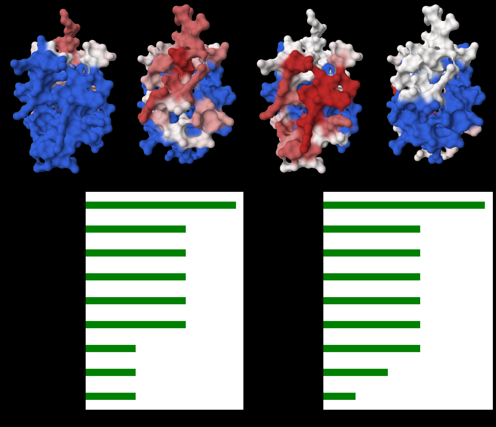
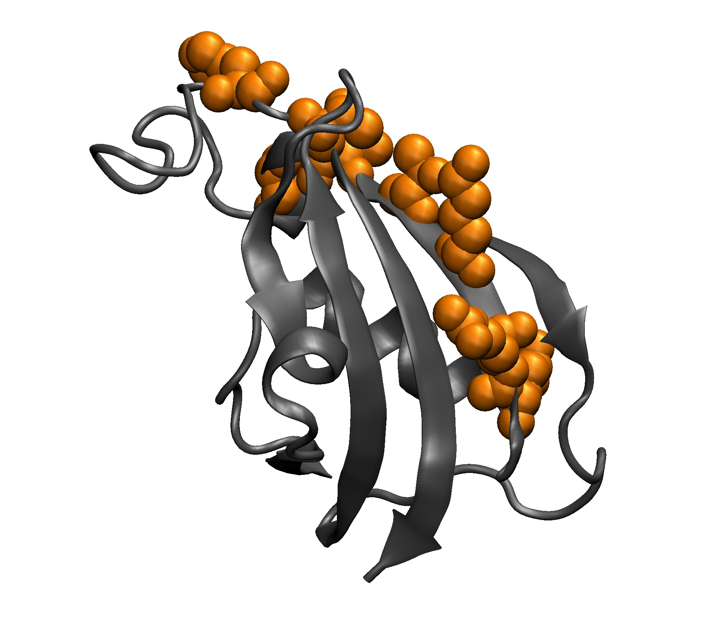
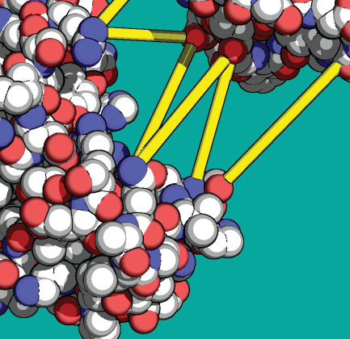
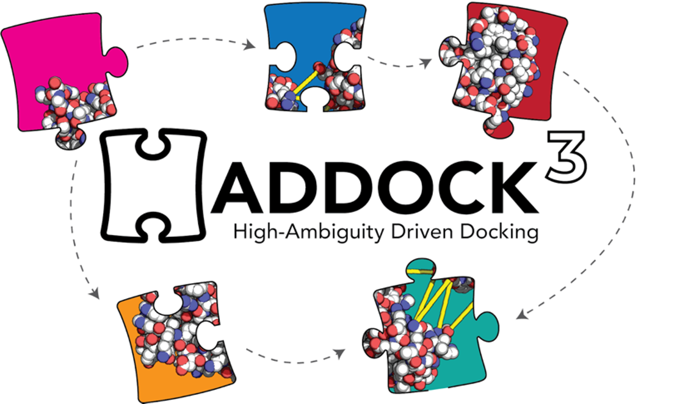
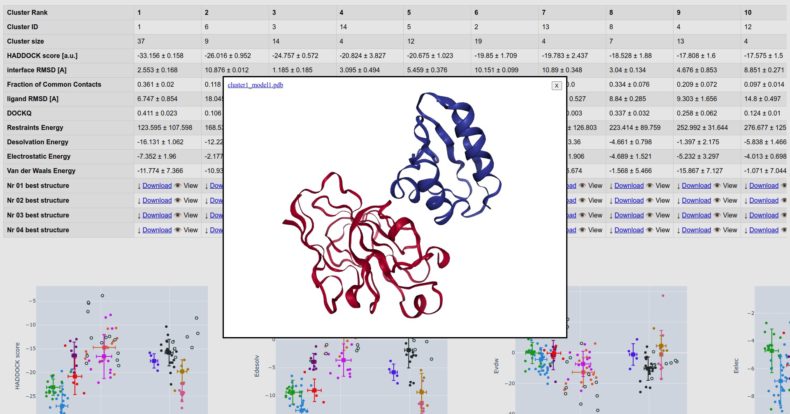

In 2003, Cyril Dominguez sat in Rolf Boelens's NMR lab in Utrecht with a familiar frustration. He had chemical shift perturbation data for the barnase--barstar complex. The NMR experiments told him exactly which residues shifted upon binding. He knew which parts of each protein touched the other. But no docking program at the time could use this information directly. The standard approach was to generate thousands of docked orientations by shape complementarity alone, then filter the results against experimental data after the fact. This was wasteful: you ran an expensive global search, and only at the end did you ask whether the answer agreed with what you already knew.[^ch09-docking-1]

Dominguez, Boelens, and Bonvin turned this logic on its head. They asked: what if the experimental data drove the docking from the start? What if, instead of treating NMR restraints as a post-hoc filter, we encoded them directly into the energy function that guides the search? The result was HADDOCK [@dominguez2003], and it changed how the field thinks about incorporating prior knowledge into structure prediction.

But before we can appreciate what HADDOCK does differently, we need to understand the docking problem itself and the algorithms that came before.

# The Docking Problem {#ch09-docking-sec:docking-problem}

**Given the three-dimensional structures of two proteins**, predict the structure of their complex. This is the protein--protein docking problem. We assume we have atomic coordinates for each partner in isolation, and we want to find how they fit together.

Consider two rigid bodies in three-dimensional space. If we fix protein A at the origin, protein B has six degrees of freedom: three rotational (specifying its orientation) and three translational (specifying its position relative to A). The rotational degrees of freedom live in $\mathrm{SO}(3)$, the group of proper rotations. We can parameterize them with three Euler angles $(\alpha, \beta, \gamma)$ or with a unit quaternion. The translational degrees of freedom live in $\mathbb{R}^3$. Together, the search space is the Special Euclidean group $\mathrm{SE}(3) = \mathrm{SO}(3) \ltimes \mathbb{R}^3$.[^ch09-docking-2]

How large is this search space? If we discretize rotations at $15^\circ$ steps, we get roughly 70,000 distinct orientations.[^ch09-docking-3] For each orientation, if the proteins span roughly 100 Å and we sample translations on a 1 Å grid, we have $\sim 10^6$ translational positions. The total number of configurations to evaluate exceeds $10^{10}$. Evaluating a full physics-based energy function at each point is computationally intractable. We need faster methods.

# Rigid-Body Docking via FFT {#ch09-docking-sec:fft-docking}

**The breakthrough came from signal processing.** In 1992, Katchalski-Katzir and colleagues realized that if we represent proteins on a three-dimensional grid, the translational search at fixed orientation becomes a correlation, and correlations can be computed efficiently using the Fast Fourier Transform [@katchalskikatzir1992].

We begin by placing protein A (the "receptor") on a cubic grid of side $N$. Each grid point $(i,j,k)$ receives a value $a_{ijk}$ that encodes the protein's shape: $$\begin{equation}
\label{eq:grid-receptor}
a_{ijk} = \begin{cases}
1 & \text{if $(i,j,k)$ is a surface point of A} \\
-15 & \text{if $(i,j,k)$ is an interior (core) point of A} \\
0 & \text{if $(i,j,k)$ is exterior to A}
\end{cases}
\end{equation}$$ The large negative value for interior points penalizes steric clashes. Surface points reward contact. Exterior points contribute nothing.

We construct a similar grid for protein B (the "ligand"), but with a simpler encoding: $$\begin{equation}
\label{eq:grid-ligand}
b_{ijk} = \begin{cases}
1 & \text{if $(i,j,k)$ is a surface point of B} \\
1 & \text{if $(i,j,k)$ is an interior point of B} \\
0 & \text{if $(i,j,k)$ is exterior to B}
\end{cases}
\end{equation}$$

Now define the shape complementarity score for a translation $(u,v,w)$ as: $$\begin{equation}
\label{eq:correlation}
C(u,v,w) = \sum_{i,j,k} a_{ijk} \cdot b_{i-u,\, j-v,\, k-w}
\end{equation}$$ A high value of $C$ means many surface--surface contacts (each contributing $+1$) and few clashes. A clash between B's interior and A's core gives $(-15)(1) = -15$, which strongly penalizes overlap.

[\[eq:correlation\]](#eq:correlation){reference-type="ref" reference="eq:correlation"} is a discrete cross-correlation. The direct computation requires $O(N^6)$ operations: for each of the $N^3$ translations, we sum over all $N^3$ grid points. But we can invoke the convolution theorem.[^ch09-docking-4] Let $\hat{A}$ and $\hat{B}$ denote the three-dimensional discrete Fourier transforms of the receptor and ligand grids. Then: $$\begin{equation}
\label{eq:fft-correlation}
C = \mathcal{F}^{-1}\!\left[\hat{A}^* \cdot \hat{B}\right]
\end{equation}$$ Computing $\hat{A}$ and $\hat{B}$ each takes $O(N^3 \log N)$ operations via FFT. The pointwise multiplication takes $O(N^3)$. The inverse FFT takes another $O(N^3 \log N)$. The total cost for one orientation is $O(N^3 \log N)$, replacing the naive $O(N^6)$.

The full algorithm proceeds as follows. For each sampled rotation $(\alpha_m, \beta_m, \gamma_m)$ of protein B:

1.  Rotate B's coordinates.

2.  Discretize the rotated B onto the grid to obtain $\{b_{ijk}\}$.

3.  Compute $C = \mathcal{F}^{-1}[\hat{A}^* \cdot \hat{B}]$.

4.  Record the top-scoring translations.

After iterating over all $\sim 70{,}000$ rotations, we rank all recorded solutions by their correlation score and retain the top candidates.

**How fine must the grid be?** Typical implementations use grid spacings of 1.0--1.5 Å and grid dimensions of $N = 128$ or $N = 256$. A single FFT correlation on a $128^3$ grid takes a fraction of a second on modern hardware. Multiplied by 70,000 rotations, the full rigid-body search completes in hours on a single processor, or minutes with GPU acceleration.

Programs that implement this approach include FTDock, ZDOCK, and ClusPro. They differ in how they augment the shape complementarity grid with electrostatic and desolvation terms (see [3](#sec:scoring-functions){reference-type="ref" reference="sec:scoring-functions"}), but the computational engine is the same.

# Scoring Functions {#ch09-docking-sec:scoring-functions}

**Shape complementarity finds geometrically feasible docking poses**, but it cannot distinguish the native complex from the many near-misses. We need scoring functions that capture the physics and chemistry of protein--protein recognition. Three philosophies dominate.

## Physics-Based Scoring

A physics-based scoring function evaluates the interaction energy between the two proteins using terms derived from molecular mechanics force fields. The total score decomposes as: $$\begin{equation}
\label{eq:physics-score}
E_\text{total} = E_\text{vdW} + E_\text{elec} + E_\text{desolv}
\end{equation}$$

The van der Waals term uses the Lennard-Jones 12-6 potential. For atom $i$ on protein A and atom $j$ on protein B separated by distance $r_{ij}$: $$\begin{equation}
\label{eq:lj-docking-score}
V_\text{LJ}(r_{ij}) = 4\varepsilon_{ij}\left[\left(\frac{\sigma_{ij}}{r_{ij}}\right)^{12} - \left(\frac{\sigma_{ij}}{r_{ij}}\right)^{6}\right]
\end{equation}$$ Here $\varepsilon_{ij}$ is the well depth and $\sigma_{ij}$ is the distance at which the potential crosses zero. The $r^{-12}$ term models Pauli repulsion at short range. The $r^{-6}$ term models London dispersion (attractive van der Waals) forces. The total van der Waals energy sums over all inter-protein atom pairs:[^ch09-docking-5] $$\begin{equation}
\label{eq:evdw}
E_\text{vdW} = \sum_{i \in A}\sum_{j \in B} V_\text{LJ}(r_{ij})
\end{equation}$$

The electrostatic term uses a Coulomb potential with a distance-dependent dielectric: $$\begin{equation}
\label{eq:elec}
E_\text{elec} = \sum_{i \in A}\sum_{j \in B} \frac{q_i q_j}{4\pi\varepsilon_0\,\varepsilon(r_{ij})\,r_{ij}}
\end{equation}$$ where $q_i$ and $q_j$ are partial atomic charges. The dielectric function $\varepsilon(r)$ accounts crudely for solvent screening. A common choice is $\varepsilon(r) = 4r$, which attenuates long-range electrostatics and implicitly mimics the effect of water.[^ch09-docking-6]

The desolvation term estimates the free energy cost of burying polar and apolar surface upon complex formation. Atomic solvation parameters (ASP), calibrated against experimental transfer free energies, assign an energy per unit of buried surface area for each atom type.

## Knowledge-Based Scoring (Statistical Potentials)

**Instead of computing energies from first principles**, we can extract effective interaction potentials from the statistics of known protein--protein complexes. The idea, borrowed from protein structure prediction, relies on Boltzmann inversion.

Let $g(r)$ be the radial distribution function for a pair of atom types at distance $r$, defined as: $$\begin{equation}
\label{eq:rdf}
g(r) = \frac{\rho_\text{obs}(r)}{\rho_\text{ref}(r)}
\end{equation}$$ where $\rho_\text{obs}(r)$ is the observed frequency of atom pairs at distance $r$ in a database of experimental complex structures, and $\rho_\text{ref}(r)$ is the expected frequency under a reference state where no specific interactions exist.

The knowledge-based potential of mean force is: $$\begin{equation}
\label{eq:kb-potential}
w(r) = -k_BT \ln g(r) = -k_BT \ln \frac{\rho_\text{obs}(r)}{\rho_\text{ref}(r)}
\end{equation}$$ Distances where atom pairs are observed more frequently than expected yield attractive (negative) potentials. Distances where they are depleted yield repulsive (positive) potentials.

The critical choice is the reference state. One option is to use the average density of atoms in a sphere of radius $r$ around any given atom (the "uniform density" reference). Another is to use the distribution seen at protein surfaces regardless of complex formation (the "surface" reference). The choice of reference state significantly affects the resulting potentials.[^ch09-docking-7]

Programs such as DFIRE, SOAP, and PIE use knowledge-based scoring. Their main advantage is speed (the potential is pre-tabulated as a lookup table) and their empirical calibration against real interfaces. Their main weakness is that they cannot extrapolate beyond the training data.

## Empirical and Machine-Learning Scoring

A third approach trains a scoring function on labeled data. We have a set of docked poses with known quality (measured, for example, by interface RMSD to the crystal structure). We extract descriptors from each pose: number of contacts, buried surface area, shape complementarity index, electrostatic energy, and so on. We then fit a model that predicts a quality score from these descriptors.

In the simplest case, this is a linear combination: $$\begin{equation}
\label{eq:empirical-score}
S = \sum_{k=1}^{K} w_k \cdot f_k
\end{equation}$$ where $f_k$ are the descriptors and $w_k$ are learned weights. More recent approaches use random forests, gradient-boosted trees, or graph neural networks to capture nonlinear relationships between descriptors and binding quality. The CAPRI experiment, which blindly evaluates docking predictions, has shown that the best rescoring methods increasingly rely on machine learning.

# Hotspot Residues and the Interface Energetics {#ch09-docking-sec:hotspots}

**Not all interface residues contribute equally to binding.** This was demonstrated decisively in 1995, when Tim Clackson and James Wells performed systematic alanine scanning mutagenesis on the human growth hormone (hGH) bound to its receptor [@clackson1995].

The hGH--receptor interface buries roughly 1,300 Å$^2$ of surface area on each side. About 30 residues from each protein make intermolecular contacts. Clackson and Wells mutated each interface residue to alanine, one at a time, and measured the effect on binding free energy $\Delta\Delta G$. The result was striking: most mutations had negligible effect. Only a small subset of residues (roughly 10% of the interface) contributed more than 2 kcal/mol each. These "hotspot" residues accounted for the majority of the binding energy.

Two residues on the hormone side, Trp-104 and Trp-169, together contributed over 6 kcal/mol. The hotspot was not distributed evenly across the interface. It was concentrated in a compact cluster at the center.[^ch09-docking-8]

**The "O-ring" hypothesis** emerged from these data. The hotspot residues sit at the center of the interface, surrounded by a ring of energetically less important residues. Bogan and Thorn proposed that this ring serves to exclude bulk solvent from the hotspot, creating a low-dielectric environment that amplifies electrostatic and van der Waals contacts at the center. If water could penetrate to the hotspot, the contacts there would be screened and weakened.

Subsequent large-scale analyses confirmed that hotspot residues are enriched in tryptophan, arginine, and tyrosine. These amino acids combine large hydrophobic surface areas with hydrogen-bonding capacity. They can simultaneously desolvate (driving the hydrophobic effect) and make specific polar contacts (conferring specificity).

The concept of hotspot residues matters for docking because it tells us that interfaces are not featureless hydrophobic patches. They have structure, hierarchy, and unequal energetic contributions. A good scoring function must capture this unevenness. And if we know where the hotspots are (from mutagenesis, NMR, or bioinformatic prediction), we can use that information to guide the search.

{#ch09-docking-fig:interface-mapping width="\\linewidth"}

# Information-Driven Docking: HADDOCK {#ch09-docking-sec:haddock}

**We return now to the problem that motivated this chapter.** Dominguez, Boelens, and Bonvin had NMR chemical shift perturbation data telling them which residues of barnase and barstar participate in the interface. They wanted a docking method that could use this information not as a post-hoc filter, but as a driving force during the search [@dominguez2003; @vanzundert2016].

Their insight was simple and powerful. Instead of sampling all orientations uniformly (as FFT-based methods do) and hoping the correct one scores well, they biased the sampling toward orientations consistent with the experimental data. They did this by adding restraint terms to the energy function, penalizing any configuration where the experimentally identified residues are not in contact.

## Ambiguous Interaction Restraints (AIRs)

The central concept in HADDOCK is the Ambiguous Interaction Restraint. We define two categories of residues for each protein:

- **Active residues**: residues experimentally identified as being at the interface (e.g., those showing large chemical shift perturbations) that are also solvent-accessible in the free form.

- **Passive residues**: surface-exposed residues that neighbor the active residues. These might participate in the interface but have not been directly identified.

::: {.column-margin}
{width="\\linewidth"}
:::

The restraint is called "ambiguous" because we do not specify which active residue on protein A contacts which residue on protein B. We only require that each active residue on A is close to *some* active or passive residue on B, without specifying which one.[^ch09-docking-9]

Formally, for each active residue $i$ on protein A, we define an effective distance to protein B: $$\begin{equation}
\label{eq:dair}
d_i^\text{AIR} = \left(\frac{1}{N_B}\sum_{j \in B_\text{active} \cup B_\text{passive}} \frac{1}{d_{ij}^6}\right)^{-1/6}
\end{equation}$$ where $d_{ij}$ is the distance between any atom of residue $i$ and any atom of residue $j$, and $N_B$ is the number of active plus passive residues on protein B. The $r^{-6}$ averaging ensures that the closest contact dominates: if even one residue $j$ on B is close to residue $i$ on A, the effective distance is small.[^ch09-docking-10]

::: {.column-margin}
{width="\\linewidth"}
:::

The AIR energy for all active residues on both proteins is: $$\begin{equation}
\label{eq:eair}
E_\text{AIR} = k_\text{AIR}\left[\frac{1}{N_A}\sum_{i \in A_\text{active}} \left(d_i^\text{AIR}\right)^2 + \frac{1}{N_B}\sum_{j \in B_\text{active}} \left(d_j^\text{AIR}\right)^2\right]
\end{equation}$$ where $k_\text{AIR}$ is a force constant and the term is applied as a flat-bottom potential: it is zero when the effective distance is below a threshold (typically 2 Å for the distance between closest heavy atoms) and quadratic above it.

## The Three-Stage Protocol

HADDOCK does not use FFT. Instead, it employs a multi-stage protocol that progressively introduces flexibility.

{#ch09-docking-fig:haddock-protocol width="\\linewidth"}

#### Stage it0: Rigid-body energy minimization.

In the first stage, both proteins are treated as rigid bodies. A large number of starting orientations are generated by randomizing the positions of the two proteins, then performing rigid-body energy minimization with the AIR restraints active. The energy function at this stage is: $$\begin{equation}
\label{eq:it0-score}
E_\text{it0} = 0.01 \cdot E_\text{vdW} + 1.0 \cdot E_\text{elec} + 1.0 \cdot E_\text{AIR} + 0.01 \cdot E_\text{desolv}
\end{equation}$$ The small weight on $E_\text{vdW}$ prevents premature trapping in local minima caused by steric clashes. The electrostatic and AIR terms dominate, pulling the proteins together in orientations consistent with the data. Typically 1,000 to 10,000 rigid-body models are generated, and the top 200 by $E_\text{it0}$ are retained.[^ch09-docking-11]

#### Stage it1: Semi-flexible simulated annealing.

The top 200 models from it0 enter a semi-flexible refinement stage. Simulated annealing molecular dynamics is performed in torsion angle space. The protocol has three phases:

First, a high-temperature phase at 2,000 K for 500 MD steps. During this phase, only interface side chains are flexible; all backbone atoms remain fixed. The high temperature allows side chains to overcome barriers and find favorable rotameric states.

Second, a slow-cooling phase from 2,000 K to 50 K over 1,000 MD steps. In this phase, both side chains and backbone atoms at the interface become flexible. This allows local backbone rearrangements to accommodate the docked orientation.

Third, a final energy minimization of the full system (200 steps of conjugate gradient minimization).

The flexibility is limited to the interface region (residues within 5 Å of the partner). Residues far from the interface remain rigid throughout. This approach captures induced-fit effects without the expense of full flexible docking.

#### Stage itw: Explicit solvent refinement.

The final stage places each complex in a shell of explicit water molecules (typically 8 Å thick) and performs a short molecular dynamics simulation (100--200 steps). This allows the interface to relax in the presence of solvent and captures water-mediated contacts that stabilize many protein--protein interfaces.

## Final Scoring

After the three stages, the refined models are scored with a different weighting: $$\begin{equation}
\label{eq:haddock-score}
E_\text{HADDOCK} = 1.0 \cdot E_\text{vdW} + 0.2 \cdot E_\text{elec} + 1.0 \cdot E_\text{desolv} + 0.1 \cdot E_\text{AIR}
\end{equation}$$ The AIR term is down-weighted at this stage because its purpose was to guide the search, not to dominate the final ranking. Now that the structures have been refined, the physical energy terms (van der Waals and desolvation) carry more weight.[^ch09-docking-12]

## Clustering and Model Selection

The 200 refined structures are not independent. Many converge to similar solutions, differing only in minor side-chain conformations. HADDOCK groups the solutions by pairwise structural similarity, relying on two metrics.

Interface RMSD (i-RMSD) measures the root-mean-square deviation of interface backbone atoms after optimal superposition of the interface region.

The Fraction of Common Contacts (FCC) measures the fraction of inter-protein residue--residue contacts shared between two models. Two residues are in contact if any pair of their atoms is within 5 Å. Given two models with contact sets $S_1$ and $S_2$: $$\begin{equation}
\label{eq:fcc}
\text{FCC}(1,2) = \frac{|S_1 \cap S_2|}{\min(|S_1|, |S_2|)}
\end{equation}$$

Models are clustered using a cutoff (typically FCC $> 0.6$ or i-RMSD $< 4$ Å). The final output reports cluster averages: the mean HADDOCK score of the top four models in each cluster. The best cluster, not the best single model, is the primary prediction.

{#ch09-docking-fig:cluster-scoring width="\\linewidth"}

## Sources of Information

The power of HADDOCK lies in its flexibility regarding input data. Any experiment or prediction that identifies interface residues can be translated into AIRs: NMR chemical shift perturbations, hydrogen-deuterium exchange mass spectrometry, cross-linking mass spectrometry, mutagenesis data, evolutionary conservation (interface residues tend to be conserved in obligate complexes), or bioinformatic interface predictions.

This information-driven philosophy broke from the "blind" approach of pure shape-based docking. In practice, we rarely dock two proteins with zero prior knowledge. We almost always know something about the interaction, and a good docking framework should let us incorporate that knowledge.

# Template-Based Docking {#ch09-docking-sec:template-docking}

**A conceptually different approach** to the docking problem asks: have we seen a similar interface before? Protein--protein interfaces are not infinitely diverse. Many unrelated complexes share similar binding geometries. Subtilisin binds multiple structurally different inhibitors using a conserved interface geometry. Serine proteases recognize serpins through recurring structural motifs.

The PRISM algorithm exploits this observation. Tuncbag, Keskin, and Gursoy proposed that known complex interfaces can serve as structural templates. The procedure works as follows.

First, build a library of template interfaces extracted from experimentally determined complexes. Each template consists of two interacting surface patches with their relative geometry.

Second, for each query protein pair, identify surface patches on both proteins and structurally align them to the template library. If a surface patch on protein A matches one side of a template, and a surface patch on protein B matches the other side, we can place A and B in the relative orientation dictated by the template.

Third, evaluate the resulting model with a physics-based energy function to filter sterically clashed or energetically unfavorable predictions.

Template-based docking has one great advantage: because it draws on known interfaces, the predicted complexes tend to have realistic interface geometries. It does not suffer from the problem of generating thousands of near-native solutions that lack the fine details of real interfaces. Its main limitation is coverage. If no template in the library resembles the true interface, the method cannot generate a correct prediction. As structural databases grow, this limitation diminishes.

# Assessing Docking Quality {#ch09-docking-sec:docking-quality}

**How do we know if a docking prediction is correct?** The Critical Assessment of PRedicted Interactions (CAPRI) experiment provides standardized quality metrics based on three quantities.

Ligand RMSD (L-RMSD) is computed after superimposing the receptor in the predicted and experimental complexes, then measuring the RMSD of the ligand backbone atoms.

Interface RMSD (i-RMSD) measures the RMSD of interface backbone atoms (those within 10 Å of the partner) after superimposing only the interface region.

The fraction of native contacts ($f_\text{nat}$) is the fraction of residue--residue contacts in the experimental structure that are also present in the prediction.

CAPRI defines quality categories based on these metrics: $$\begin{equation}
\label{eq:capri-quality}
\begin{aligned}
\text{High quality:}& \quad f_\text{nat} \geq 0.5 \text{ and } (\text{L-RMSD} \leq 1\text{\,\AA} \text{ or } \text{i-RMSD} \leq 1\text{\,\AA}) \\
\text{Medium quality:}& \quad f_\text{nat} \geq 0.3 \text{ and } (\text{L-RMSD} \leq 5\text{\,\AA} \text{ or } \text{i-RMSD} \leq 2\text{\,\AA}) \\
\text{Acceptable:}& \quad f_\text{nat} \geq 0.1 \text{ and } (\text{L-RMSD} \leq 10\text{\,\AA} \text{ or } \text{i-RMSD} \leq 4\text{\,\AA})
\end{aligned}
\end{equation}$$

These categories capture the intuition that a useful docking prediction need not be perfect. An acceptable prediction correctly identifies the binding interface even if the precise orientation is slightly off. A high-quality prediction is essentially indistinguishable from the experimental structure for most downstream applications.

# The Flexible Docking Problem {#ch09-docking-sec:flexible-docking}

**We have so far treated docking as a rigid-body problem**, but proteins change shape upon binding. Induced fit, conformational selection, and allosteric rearrangements all mean that the bound structure differs from the unbound. The magnitude of conformational change varies widely. Some complexes form with negligible rearrangement (antibody--antigen complexes with rigid epitopes). Others involve large domain motions (kinases closing around substrates).

The challenge of flexibility is computational. If both proteins have $M$ flexible degrees of freedom each, the search space expands from 6 dimensions to $6 + 2M$ dimensions. Even allowing just side-chain flexibility at the interface (say, 20 residues with 2 torsion angles each) adds 40 degrees of freedom. Full backbone flexibility is worse.

Three strategies dominate.

Soft docking reduces the Lennard-Jones repulsion (by using a softer potential or by reducing $\varepsilon$) so that slightly overlapping conformations are tolerated during the search. After identifying promising orientations, we refine with full potentials and allow local flexibility. HADDOCK's three-stage protocol is an instance of this philosophy: the rigid-body stage uses a permissive energy function, and only the later refinement stages enforce strict steric complementarity.

Ensemble docking takes a different tack. Instead of docking a single structure, we dock an ensemble of conformations for each protein, drawn from NMR ensembles, MD simulations, or normal-mode perturbations. Each member captures a different conformation that the protein might adopt. The computational cost multiplies by the ensemble size, but the approach can capture large conformational changes without explicitly sampling them during docking.

On-the-fly flexibility rebuilds side chains or even backbone segments during the docking search itself. RosettaDock couples a low-resolution rigid-body search with Monte Carlo side-chain repacking and backbone minimization, allowing the protein to adjust its conformation in response to the docking partner at each step.

# From Pairwise Docking to Integrative Modeling {#ch09-docking-sec:integrative}

**Real biological assemblies involve more than two proteins.** The ribosome has over 50 protein subunits. The nuclear pore complex contains roughly 30 distinct proteins in multiple copies, totaling over 500 chains. Predicting the structures of such assemblies requires going beyond pairwise docking.

Integrative modeling, as implemented in programs like IMP (Integrative Modeling Platform), combines diverse experimental data with computational sampling. Cryo-EM maps provide overall shape at intermediate resolution. Cross-linking mass spectrometry constrains distances between specific residue pairs. Small-angle X-ray scattering provides information about overall dimensions. Co-evolutionary analysis predicts inter-protein contacts.

The integrative approach does not privilege any single data type. Instead, it formulates the structure determination problem as a Bayesian inference: find the structure (or ensemble of structures) that best satisfies all available data, weighted by each dataset's reliability. Information-driven docking, as introduced by HADDOCK, was an early instance of this philosophy applied to binary complexes. Integrative modeling extends it to arbitrarily large assemblies.

# Chapter Notes {#ch09-docking-sec:docking-notes}

The FFT approach to rigid-body docking was introduced by Katchalski-Katzir et al. in 1992 [@katchalskikatzir1992]. The paper is a model of clarity: the key insight (correlation equals convolution, convolution is cheap via FFT) is explained in two pages. Many subsequent programs built on this foundation. ZDOCK (Chen, Li, and Weng, 2003) added electrostatics and desolvation to the grid. ClusPro (Kozakov et al., 2017) automated the entire pipeline including clustering and energy minimization. PIPER (Kozakov et al., 2006) extended the FFT approach to pairwise potentials.

HADDOCK was published in 2003 [@dominguez2003] and has been updated continuously since. HADDOCK 2.2 [@vanzundert2016] introduced a web server that made information-driven docking accessible to non-experts. HADDOCK 3.0, released in 2024, adopted a modular workflow engine that allows users to customize the docking protocol. The HADDOCK server has been used in over 20,000 published studies.

The alanine scanning work by Clackson and Wells [@clackson1995] remains one of the most cited papers in protein interaction energetics. The ASEdb (Alanine Scanning Energetics database) and later the SKEMPI database compiled thousands of such measurements, enabling the training of computational hotspot predictors. The Robetta alanine scanning server and FoldX provide fast computational approximations of $\Delta\Delta G$ upon mutation.

Knowledge-based scoring functions trace their intellectual lineage to Sippl's (1990) work on statistical potentials for single proteins. Their application to protein--protein scoring was developed independently by several groups in the early 2000s. The DFIRE potential (Zhou and Zhou, 2002) and SOAP (Dong et al., 2013) are widely used.

The CAPRI experiment (Critical Assessment of PRedicted Interactions) has run since 2001, providing blind benchmarks for the docking community. CAPRI results consistently show that methods combining experimental data with computational docking outperform purely computational approaches. This observation validates the information-driven philosophy that HADDOCK pioneered.

Template-based docking (PRISM) was developed by the Gursoy and Keskin group at Koc University. Their insight that interfaces are reusable structural motifs connects protein docking to the broader theme of structural modularity in biology. Interface databases such as PIFACE and SCOPPI catalog recurring interface architectures.

The convergence of deep learning with docking is reshaping the field. AlphaFold-Multimer [@evans2022] directly predicts complex structures without an explicit docking step, by co-folding multiple chains. EquiDock and DiffDock use SE(3)-equivariant neural networks and diffusion models, respectively, to generate docked poses. Whether these learned methods will fully replace physics-based and information-driven docking remains an open question. Their accuracy on well-represented complex types is impressive, but their behavior on unusual interfaces or in the presence of sparse experimental data is less established. The information-driven philosophy, which treats experimental evidence as a first-class citizen in the modeling process, will likely remain relevant regardless of the sampling engine underneath.

[^ch09-docking-1]: The barnase--barstar complex (PDB: 1BRS) is a classic benchmark for docking. Barnase is a ribonuclease; barstar is its intracellular inhibitor. Their binding affinity is among the highest known for protein--protein interactions, with $K_d \approx 10^{-14}$ M.

[^ch09-docking-2]: $\mathrm{SE}(3)$ is the group of rigid-body transformations in three dimensions. It has six dimensions: three rotational and three translational.

[^ch09-docking-3]: The number of orientations depends on the angular step $\Delta\theta$. For uniform sampling of $\mathrm{SO}(3)$, the number scales as $(360/\Delta\theta)^3 / \text{symmetry factor}$. At $15^\circ$ steps, this gives approximately $24^3 / 4 \approx 70{,}000$ for asymmetric objects.

[^ch09-docking-4]: The convolution theorem states that the Fourier transform of a correlation is the pointwise product of the Fourier transform of one function with the complex conjugate of the Fourier transform of the other: $\mathcal{F}[C] = \hat{A}^* \cdot \hat{B}$.

[^ch09-docking-5]: In practice, we truncate the sum at a cutoff distance (typically 8--12 Å) because the $r^{-6}$ potential decays rapidly.

[^ch09-docking-6]: A distance-dependent dielectric is a gross simplification. More rigorous treatments solve the Poisson--Boltzmann equation or use Generalized Born models. But for fast scoring of thousands of docking poses, the linear dielectric is a useful approximation.

[^ch09-docking-7]: The reference state problem is analogous to the choice of null model in sequence alignment scoring. Just as PAM and BLOSUM matrices differ in their reference, knowledge-based potentials differ depending on how we define "no interaction."

[^ch09-docking-8]: The concentration of binding energy at a few residues has practical implications. It means that a small molecule mimicking the hotspot geometry might recapitulate the binding of a large protein surface. This observation underlies the field of protein--protein interaction inhibitors.

[^ch09-docking-9]: Ambiguity is important because NMR chemical shift perturbation data identifies interface residues but does not directly reveal their specific inter-protein contacts. Requiring specific pairings would over-constrain the problem.

[^ch09-docking-10]: The $r^{-6}$ averaging is borrowed from NOE distance restraints in NMR structure determination, where the same functional form arises from the $r^{-6}$ dependence of the nuclear Overhauser effect.

[^ch09-docking-11]: The number of starting structures and the selection cutoff are adjustable parameters. For well-defined restraints (many active residues identified with high confidence), fewer starting structures suffice. For ambiguous data, more thorough sampling is needed.

[^ch09-docking-12]: The different weightings between it0 and the final scoring reflect a deliberate strategy: use experimental data aggressively during sampling, then rely on physics for discrimination among converged solutions.
